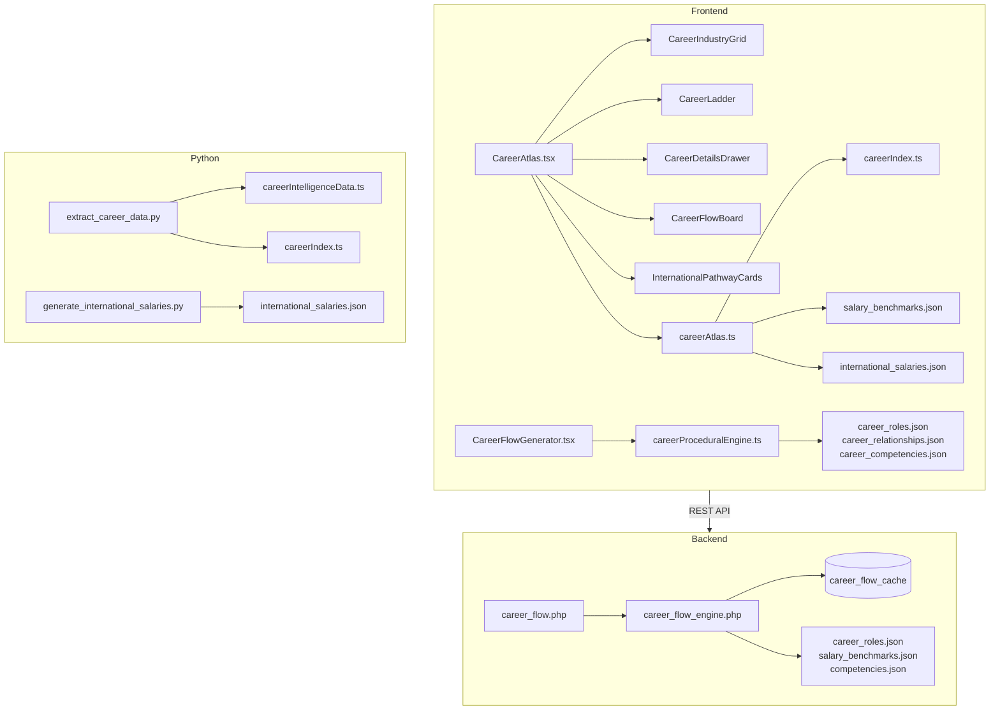
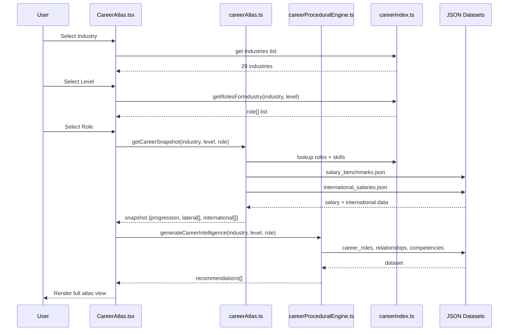
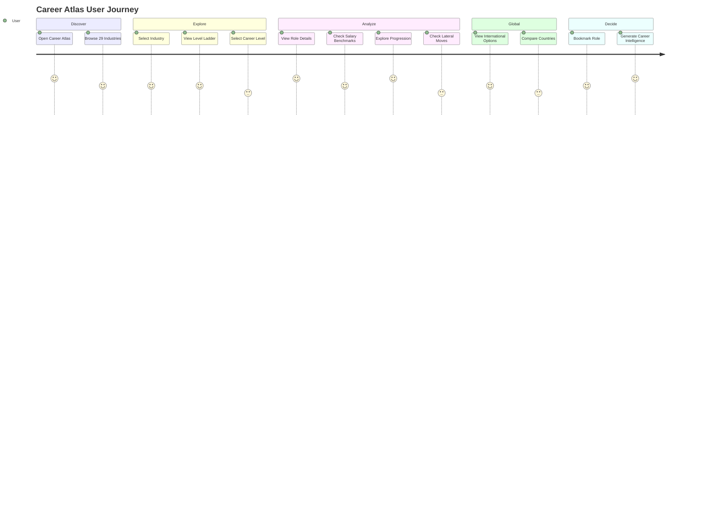

# 01_Career_Direction.md — Career Atlas & Career Intelligence

## Project Overview

- **Project Name:** NearbyHiring — AI-Powered Job & Career Platform
- **Module Name:** Career Direction (Career Atlas & Career Intelligence Engine)
- **Current Completion Status:** 95% Complete (Phase 2)
- **Technology Stack:** React 18, TypeScript 5, Vite 5, Tailwind CSS v4, Framer Motion, Recharts, Lucide Icons, React Flow, Dagre
- **Primary Entry File:** `src/pages/CareerAtlas.tsx` (1707 lines)
- **Primary Route:** `/career-atlas`
- **Supporting Routes:** `/career-flow/generator`
- **Backend:** PHP (career_flow_engine.php, career_flow.php)
- **Database:** MySQL (career_nodes, career_edges, career_flow_cache) + SQLite (interview)
- **Python Scripts:** `data/generate_international_salaries.py`, `scripts/extract_career_data.py`
- **JSON Datasets:** `public/data/career_intelligence/` (roles, relationships, competencies, recommendations, statistics)
- **Auto-generated TS Files:** `src/data/careerIndex.ts` (5809 lines), `src/data/careerIntelligenceData.ts` (471,749 lines)

---

## Purpose

Career Direction provides a comprehensive career intelligence atlas for Indian job seekers. It helps users explore career progression paths across 29 industries, 6 career levels (Entry through Leadership), with detailed role information including salary benchmarks, required skills, lateral moves, and international opportunities.

### Business Goal

Empower students, freshers, and professionals to make informed career decisions by providing transparent, data-driven career maps — reducing the information asymmetry that plagues the Indian job market.

### Problem Solved

Indian students and professionals lack visibility into:
- What career progression looks like in their industry
- What skills they need to advance
- What salary to expect at each level
- What lateral or international moves are possible
- How their career path compares across industries

### Target Users

- School/college students planning their careers
- Freshers entering the job market (Entry Level)
- Mid-career professionals seeking advancement (Supervisory → Middle → Executive)
- Senior professionals planning leadership transitions (Higher → Leadership)
- Career switchers exploring lateral/cross-industry moves
- Professionals considering international opportunities

---

## Features

| Feature | Description | Status |
|---------|-------------|--------|
| Industry Explorer | Browse 29 industries with search and sector filtering (Core/Emerging) | Complete |
| Career Level Ladder | Visual 6-level progression ladder with role mapping | Complete |
| Role Detail Drawer | Comprehensive role details: salary, skills, progression, laterals | Complete |
| Salary Benchmarks | India (INR LPA) + International salary comparisons | Complete |
| International Mobility | Country-specific pathways with visa info, salary, demand | Complete |
| Lateral Move Analysis | Adjacent roles, cross-industry transitions | Complete |
| Skill Gap Analysis | Required skills per level + missing skill identification | Complete |
| Career Snapshot Engine | Procedural engine generating 14 types of recommendations | Complete |
| Role Bookmarks | Save/bookmark roles for later reference (localStorage) | Complete |
| Auth-Gated Content | Higher levels locked for non-authenticated users | Complete |
| URL Deep-Linking | Direct URLs to industry/level/role combinations | Complete |
| Search & Filter | Industry search + sector filter (Core/Emerging) | Complete |

---

## Complete User Flow

```
User opens /career-atlas
  → Industry selection grid (29 industries, searchable)
  → Selects an industry
    → Career level ladder appears (6 levels)
    → Selects a level
      → Roles at that level are listed
      → Selects a role
        → Career Snapshot loads:
          1. Progression Ladder (6 levels with skills/salary/criteria)
          2. Lateral Moves (3 groups: adjacent, level, skill-linked)
          3. International Opportunities (country-specific data)
          4. Required Competencies (skill chips)
        → Can bookmark role
        → Can explore via tabs:
          - "flow" → CareerFlowBoard interactive graph
          - "journey" → Timeline view
          - "vertical" → Ladder view
          - "lateral" → Lateral moves
          - "global" → International opportunities
```

## Screen Flow

```
CareerAtlas (main page)
├── Industry Grid (CareerIndustryGrid)
│   ├── Search bar
│   ├── Sector filter (All / Core / Emerging)
│   └── Industry cards (icon, name, role count, sector badge)
├── Career Ladder (CareerLadder)
│   ├── 6 level columns (Entry → Leadership)
│   ├── Role cards per level
│   └── Auth gate (Middle+ levels locked)
├── Role Detail (CareerDetailsDrawer)
│   ├── Salary benchmarks (India + global)
│   ├── Required competencies
│   ├── Vertical progression map
│   └── Adjacent lateral moves
├── Career Flow Board (CareerFlowBoard)
│   ├── 6 horizontal lanes
│   ├── SVG bezier-curve connections
│   └── BFS path highlighting
└── International Pathways (InternationalPathwayCards)
    ├── Country cards with flags
    ├── Salary, visa, demand data
    └── Auth gate for details
```

## Navigation Flow

```
Main Nav → Career Flow link → /career-atlas
CareerAtlas → Industry click → Level grid → Role click → Detail drawer
CareerAtlas → Tab switch → flow | journey | vertical | lateral | global
CareerFlowGenerator → /career-flow/generator → Industry + Level + Role + Focus Areas → Generate
```

## UI Flow

```
1. Page loads with industry grid (29 cards, 2 sectors)
2. User filters by search or sector
3. User clicks an industry card
4. Level ladder slides in with 6 levels
5. Entry level auto-expands with role chips
6. User clicks a role chip
7. CareerDetailsDrawer opens from right (desktop) / bottom (mobile)
8. Drawer shows tabs: Salary | Skills | Progression | Laterals | Global
9. CareerFlowBoard below the ladder shows interactive graph
10. User can bookmark role (persists to localStorage)
11. Non-authenticated users see lock icon on Middle+ levels
```

## Backend Flow

```
PHP Career Flow API:
GET /api/career_flow.php?industry=X&career_level=Y&job_title=Z
  → career_flow_engine.php:
    1. Loads JSON datasets from /data/career_intelligence/
    2. Normalizes industry name
    3. Generates MD5 cache key
    4. Checks career_flow_cache table
    5. If cached: returns cached response
    6. If not cached:
       a. Generate main pathway (6 levels, 2 stages per level)
       b. Generate alternate pathways (4 sibling roles)
       c. Generate international paths (5 priority countries)
       d. Build diagram nodes/edges
       e. Cache result (30-day expiry)
       f. Return response
```

## Frontend Flow

```
CareerAtlas.tsx mount:
  1. Load CAREER_INDUSTRIES, CAREER_LEVELS from careerIndex.ts
  2. Read URL params for deep-linking (industry, level, role)
  3. Render industry grid
  4. On industry select -> load levels -> load roles
  5. On role select -> call getCareerSnapshot(industry, level, role)
  6. Snapshot data drives all tabs/views
```

### `getCareerSnapshot()` from `careerAtlas.ts` (342 lines):
```
Input: industry, level, role
Process:
  1. Build progression array (6 levels): each with title, desc, yearsRequired, promotionCriteria, requiredSkills, nextLevelSkills, nationalSalary, internationalSalary, upskillingPrograms, positionTag
  2. Build lateral moves (3 groups): "Industry Adjacent Roles", "Level Lateral Moves", "Skill-Linked Alternatives"
  3. Build international opportunities from international_salaries.json
Output: { progression[], lateral[], international[] }
```

### `generateCareerIntelligence()` from `careerProceduralEngine.ts` (766 lines):
```
Input: industry, level, role, roleId, focusAreas[]
Process:
  1. Load career_roles.json, career_relationships.json, career_competencies.json, career_recommendations.json
  2. Filter relationships by type (PROMOTION, LATERAL, CROSS_INDUSTRY, etc.)
  3. Get competencies for current + target roles
  4. For each focus area: render templates with skill/competency/career-level placeholders
  5. Return CareerRecommendation[] with confidence scores
Output: Array of 14 recommendation types with rendered templates
```

## Database Flow

### Tables (from `career_flow_schema.sql`)

```sql
career_nodes:
  id INT PK AUTO_INCREMENT
  job_id INT (FK → jobs.id)
  node_key VARCHAR(50) UNIQUE(job_id, node_key)
  label VARCHAR(255)
  level ENUM('Entry','Supervisory','Middle','Executive','Higher','Leadership')
  pathway_type ENUM('Main','Alternate','International')
  salary_range VARCHAR(100)
  created_at TIMESTAMP

career_edges:
  id INT PK AUTO_INCREMENT
  job_id INT (FK → jobs.id)
  source_node VARCHAR(50)
  target_node VARCHAR(50)
  edge_type VARCHAR(50) DEFAULT 'smoothstep'
  created_at TIMESTAMP
  INDEX(job_id, source_node, target_node)

career_flow_cache:
  id INT PK AUTO_INCREMENT
  cache_key VARCHAR(255) UNIQUE
  industry VARCHAR(255)
  job_title VARCHAR(255)
  career_level VARCHAR(50)
  response_json LONGTEXT
  created_at TIMESTAMP
  expires_at TIMESTAMP
```

### Data Sources (JSON files)

| File | Location | Purpose |
|------|----------|---------|
| `career_roles.json` | `public/data/career_intelligence/` | 29 industries, 6 levels, role definitions |
| `career_relationships.json` | `public/data/career_intelligence/` | 160,836 relationships (7 types) |
| `career_competencies.json` | `public/data/career_intelligence/` | Role-specific skills/competencies |
| `career_recommendations.json` | `public/data/career_intelligence/` | Pre-computed career recommendations |
| `career_statistics.json` | `public/data/career_intelligence/` | Aggregated statistics |
| `salary_benchmarks.json` | `data/` | Industry + level salary data (INR LPA) |
| `international_salaries.json` | `data/` | 14 countries, role-specific salary/visa data |
| `master_career_paths.json` | `data/` | Legacy 24-industry dataset |

### Auto-generated TypeScript

| File | Lines | Content |
|------|-------|---------|
| `src/data/careerIndex.ts` | 5,809 | 29 industries, 1310 roles, 160K relationships, compact index |
| `src/data/careerIntelligenceData.ts` | 471,749 | Full career intelligence dataset (14 MB) |

## Python Flow

### `scripts/extract_career_data.py` (117 lines)
- Reads JSON from `generated_output/json/` directory
- Outputs TypeScript modules: `careerIntelligenceData.ts` + `careerIndex.ts`
- Builds: CAREER_INDUSTRIES, CAREER_LEVELS, ROLE_LOOKUP, ROLES_BY_INDUSTRY_LEVEL, RELATIONSHIPS_BY_ROLE, COMPETENCIES_BY_ROLE, RECOMMENDATIONS_BY_ROLE

### `data/generate_international_salaries.py` (540 lines)
- Generates `international_salaries.json` for 14 countries
- Industry-country relevance mapping (29 industries × 7 countries each)
- Role-level salary scaling with currency conversion
- Visa pathway, market demand, qualification requirement, skills focus data

## JSON Structure

### Career Role (from career_roles.json)
```json
{
  "id": "ai-engineer",
  "title": "AI Engineer",
  "industry_name": "IT & Software Services",
  "career_level": "Middle Level",
  "sector": "Core",
  "primary_skill_focus": "Machine Learning",
  "example_skill_category": "AI/ML",
  "example_competencies_category": "Technical",
  "level_index": 2
}
```

### Career Relationship
```json
{
  "source_id": "ai-engineer",
  "target_id": "senior-ai-engineer",
  "relationship_type": "PROMOTION",
  "confidence": 0.95,
  "weight": 1.0
}
```

### International Salary Entry
```json
{
  "country": "USA",
  "country_code": "US",
  "target_role": "Senior AI Engineer",
  "currency_code": "USD",
  "salary_min_local": 120000,
  "salary_max_local": 180000,
  "salary_min_inr_lpa": 996,
  "salary_max_inr_lpa": 1494,
  "visa_pathway": "H-1B Visa",
  "market_demand": "Very High"
}
```

## Folder Structure

```
src/
├── pages/
│   ├── CareerAtlas.tsx            ← Main page (1707 lines)
│   ├── CareerFlow.tsx             ← Landing page (1921 lines)
│   └── CareerFlowGenerator.tsx    ← Generator tool (584 lines)
├── components/CareerFlow/
│   ├── types.ts                   ← Core TypeScript types
│   ├── index.ts                   ← Barrel exports
│   ├── CareerFlowBoard.tsx        ← Interactive graph board (586 lines)
│   ├── CareerDiagram.tsx          ← React Flow diagram
│   ├── CareerFlowNode.tsx         ← Custom React Flow node
│   ├── CareerFlowPanel.tsx        ← Data panel
│   ├── CareerLadder.tsx           ← Level ladder (190 lines)
│   ├── CareerDetailsDrawer.tsx    ← Role detail drawer (255 lines)
│   ├── CareerIndustryGrid.tsx     ← Industry grid (156 lines)
│   ├── MainPathwayTimeline.tsx    ← Timeline view
│   ├── AlternatePathwayCards.tsx  ← Lateral move cards
│   ├── InternationalPathwayCards.tsx ← International cards (137 lines)
│   ├── PremiumCareerCanvas.tsx    ← Canvas view (145 lines)
│   ├── StudentCareerFlowStrip.tsx ← Mobile strip (237 lines)
│   └── CareerFlowSkeleton.tsx     ← Loading skeletons (203 lines)
├── lib/
│   ├── careerAtlas.ts             ← Core data layer (342 lines)
│   ├── careerProceduralEngine.ts  ← Recommendation engine (766 lines)
│   └── career-path-engine.ts      ← Graph layout engine (639 lines)
├── data/
│   ├── careerIndex.ts             ← Auto-generated index (5809 lines)
│   ├── careerIntelligenceData.ts  ← Auto-generated dataset (471K lines)
│   └── master_career_paths.json   ← Legacy dataset
public/data/career_intelligence/
│   ├── career_roles.json
│   ├── career_relationships.json
│   ├── career_competencies.json
│   ├── career_recommendations.json
│   ├── career_statistics.json
│   └── validation_report.json
data/
│   ├── salary_benchmarks.json
│   ├── international_salaries.json
│   ├── generate_international_salaries.py
│   └── master_career_paths.json
backend/
├── api/career_flow.php            ← API endpoint (52 lines)
├── includes/career_flow_engine.php ← PHP engine (945 lines)
database/career_flow_schema.sql     ← DB schema
scripts/extract_career_data.py      ← Python data extractor
```

## Important Files

| File | Path | Role |
|------|------|------|
| CareerAtlas.tsx | `src/pages/CareerAtlas.tsx` | Main page — industry grid, level ladder, role detail, tabs |
| CareerFlow.tsx | `src/pages/CareerFlow.tsx` | Marketing landing page for career flow feature |
| CareerFlowGenerator.tsx | `src/pages/CareerFlowGenerator.tsx` | AI-style recommendation generator tool |
| careerAtlas.ts | `src/lib/careerAtlas.ts` | Data layer — loads JSON, builds career snapshots |
| careerProceduralEngine.ts | `src/lib/careerProceduralEngine.ts` | Generates 14 types of career recommendations |
| career-path-engine.ts | `src/lib/career-path-engine.ts` | Dagre graph layout engine for React Flow |
| careerIndex.ts | `src/data/careerIndex.ts` | Auto-generated 29-industry index |
| careerIntelligenceData.ts | `src/data/careerIntelligenceData.ts` | 14 MB full career dataset |
| career_flow.php | `backend/api/career_flow.php` | PHP API endpoint for career data |
| career_flow_engine.php | `backend/includes/career_flow_engine.php` | PHP career flow generation engine |
| career_flow_schema.sql | `database/career_flow_schema.sql` | DB schema for nodes/edges/cache |
| generate_international_salaries.py | `data/generate_international_salaries.py` | Python international salary generator |
| extract_career_data.py | `scripts/extract_career_data.py` | Python TS data extractor |

## Important Components

| Component | File | Purpose |
|-----------|------|---------|
| CareerFlowBoard | `src/components/CareerFlow/CareerFlowBoard.tsx` | 6-lane interactive graph with bezier connections |
| CareerLadder | `src/components/CareerFlow/CareerLadder.tsx` | Vertical/horizontal level ladder |
| CareerDetailsDrawer | `src/components/CareerFlow/CareerDetailsDrawer.tsx` | Slide-out role detail panel |
| CareerIndustryGrid | `src/components/CareerFlow/CareerIndustryGrid.tsx` | Industry selection grid |
| CareerDiagram | `src/components/CareerFlow/CareerDiagram.tsx` | React Flow career diagram |
| CareerFlowPanel | `src/components/CareerFlow/CareerFlowPanel.tsx` | Main data panel with tabs |
| InternationalPathwayCards | `src/components/CareerFlow/InternationalPathwayCards.tsx` | International opportunity cards |
| PremiumCareerCanvas | `src/components/CareerFlow/PremiumCareerCanvas.tsx` | Timeline/canvas view |
| CareerFlowNode | `src/components/CareerFlow/CareerFlowNode.tsx` | Custom React Flow node (3 types) |

## Important APIs

| Endpoint | Method | Input | Output |
|----------|--------|-------|--------|
| `/api/career_flow.php` | GET | `job_id`, `industry`, `career_level`, `job_title` | CareerFlowResponse with main/alternate/international pathways |

## Important Utilities

| Utility | File | Purpose |
|---------|------|---------|
| `getCareerSnapshot()` | `src/lib/careerAtlas.ts` | Builds full career snapshot for industry/level/role |
| `generateCareerIntelligence()` | `src/lib/careerProceduralEngine.ts` | Generates 14 types of career recommendations |
| `buildCareerDiagram()` | `src/lib/career-path-engine.ts` | Builds React Flow nodes/edges with dagre layout |
| `buildLocalFallbackFlow()` | `src/lib/career-path-engine.ts` | Generates fallback career flow when no backend |
| `layoutCareerDiagramElements()` | `src/lib/career-path-engine.ts` | Manual layout engine for LR/TB directions |

## Application Logic

### Industry → Level → Role Selection
- 29 industries defined in `careerIndex.ts` (15 Emerging, 14 Core)
- 6 career levels: Entry → Supervisory → Middle → Executive → Higher → Leadership
- Roles loaded from `ROLES_BY_INDUSTRY_LEVEL` map (1310 total roles)
- Level 0-1 (Entry/Supervisory) accessible without auth; levels 2-5 require login

### Career Snapshot Generation
- `getCareerSnapshot()` in `careerAtlas.ts` builds 6-level progression array
- Each level includes: title, description, yearsRequired, promotionCriteria, requiredSkills, nextLevelSkills, nationalSalary, internationalSalary, upskillingPrograms, positionTag
- Lateral moves: 3 groups of related roles with flow descriptions
- International: country-specific data from international_salaries.json

### CareerFlowBoard Graph Logic
- Builds 6 horizontal lanes (one per level)
- Role cards placed in their level lane
- SVG Bezier curves connect roles across levels
- BFS path highlighting when role selected (forward AND backward traversal)
- Legend shows 6 level colors with icons

## Rendering Logic

- **Industry Grid**: Cards with icon, name, role count, sector badge. Click → loads levels.
- **Level Ladder**: CareerLadder component shows 6 levels with horizontal layout. Level 0-1 expanded, 2-5 have lock overlay for non-auth users.
- **Role Cards**: Cards in each level show role title. Click → CareerDetailsDrawer opens.
- **CareerDetailsDrawer**: Slide from right (desktop) or bottom (mobile). Shows salary, skills, progression, laterals.
- **CareerFlowBoard**: SVG canvas with BFS-connected graph. 600+ nodes rendered with bezier curves.
- **International Cards**: Country flag (flagcdn.com), salary in local currency + INR, visa pathway, demand badge.

## Search Logic

- **Industry Search**: Filter industries by name match (case-insensitive)
- **Sector Filter**: "All Sectors" / "Core Industries" / "Emerging Tech" — filters industry list
- **Role Search**: CareerFlowBoard has role text search within the board

## Filtering Logic

- `sectorFilter`: `"all" | "Core" | "Emerging"` — filters industries list
- `activeTab`: `"flow" | "journey" | "vertical" | "lateral" | "global"` — switches view mode
- Auth gate: Non-authenticated users restricted to Entry + Supervisory levels
- Loaded role filtering: Only roles present in `ROLES_BY_INDUSTRY_LEVEL` for selected industry+level

## State Management

### CareerAtlas.tsx (18 state variables)
```typescript
selectedIndustry: string | null
selectedLevel: string | null
selectedRole: string | null
activeTab: "flow" | "journey" | "vertical" | "lateral" | "global"
industrySearch: string
sectorFilter: "all" | "Core" | "Emerging"
showHowToUse: boolean
sidebarOpen: boolean
isDrawerOpen: boolean
bookmarkedRoles: string[]
pendingBookmarkRole: string | null
isAuthDialogOpen: boolean
isLoading: boolean
isGenerated: boolean
globalCountrySearch: string
countryFilterOpen: boolean
visibleCountries: string[]
loadingSlots: number[]
scrollYProgress: MotionValue<number>
```

### CareerFlowGenerator.tsx (similarly managed)
- Industry/level/role selection + focus areas multi-select
- Generation animation states (ticker → skeleton → results)
- Pagination (25 items/page), tab filters for 14 recommendation types

## Local Storage

| Key | Content | Purpose |
|-----|---------|---------|
| `nearby_atlas_bookmarks` | `string[]` of role IDs | Persist bookmarked roles across sessions |

## Session Usage

- Session ID tracked via PHP session cookie for auth status
- `pendingBookmarkRole` stored in sessionStorage until auth completes

## Future Scalability

- Current 29 industries can expand — add industry in careerIndex.ts + JSON datasets
- 6 career levels can be extended by adding to LEVEL_ORDER
- International countries (currently 14) can be added via generate_international_salaries.py
- CareerFlowBoard can support drag-to-rearrange for admin curation
- Career recommendations can be ML-powered (currently rule-based templates)

## Performance Notes

- careerIntelligenceData.ts is 14 MB — loaded via dynamic import, not bundled
- CareerFlowBoard SVG rendering uses memoized BFS — OK for ~600 nodes
- Skeleton shimmer (1.5s) used during industry/level/role transitions
- Country rotation (2s interval) for global tab — uses visibleCountries slice
- All JSON data cached by browser after first fetch

## Dependencies

- `reactflow` + `dagre` — Career graph diagram rendering and layout
- `framer-motion` — Animations (scroll progress, stagger, transitions)
- `recharts` — Salary comparison charts (future)
- `@tanstack/react-query` — Career flow API data fetching
- `lucide-react` — Icons for levels, industries, features
- `react-router-dom` — Routing + URL params for deep-linking

## Known Limitations

1. Career intelligence dataset is auto-generated from JSON rules — not ML-trained
2. International salary data is estimated from industry benchmarks, not real-time
3. CareerFlowBoard auth gate is frontend-only (checks localStorage role)
4. Role progression paths are illustrative, not guaranteed career outcomes
5. Industry coverage (29) does not cover all NCS/NSDC-classified sectors

## Future Improvements

1. **ML-Powered Predictions**: Replace rule-based templates with actual ML models
2. **Real-Time Salary Data**: Integration with job posting APIs for live salary feeds
3. **User Progress Tracking**: Let users track their career journey with milestones
4. **Mentor Matching**: Connect users with professionals at target roles
5. **Course Recommendations**: Link skill gaps to specific courses (NPTEL, SWAYAM, Coursera)
6. **Company Integration**: Show hiring companies per role with active job listings
7. **Admin Curation UI**: Drag-drop node editor for admin-curated career graphs
8. **PDF Export**: Generate career roadmap PDFs for offline reference

---

## Architecture Diagram (Mermaid)



## Data Flow Diagram (Mermaid)



## User Journey (Mermaid)



---

## AI Model Context

### Architecture Overview
The Career Direction module is a **data-driven intelligence layer** built on top of the main NearbyHiring platform. It operates primarily on the frontend with static JSON datasets, with an optional PHP backend for dynamic career flow generation.

### Dependencies
- **Critical:** `careerIndex.ts`, `careerAtlas.ts`, `careerProceduralEngine.ts`, `career-path-engine.ts`
- **Data:** 6 JSON files in `public/data/career_intelligence/` + `salary_benchmarks.json` + `international_salaries.json`
- **UI:** 15 CareerFlow components in `src/components/CareerFlow/`
- **Layout:** React Flow + Dagre for graph rendering

### Things That Must Never Be Changed
1. The `CAREER_INDUSTRIES` array structure in careerIndex.ts (used across 5+ files)
2. The `LEVEL_ORDER` constant in careerAtlas.ts (6 levels expected everywhere)
3. The `CareerFlowResponse` type in CareerFlow/types.ts (consumed by both frontend and backend)
4. The BFS highlighting logic in CareerFlowBoard (carefully balanced for performance)

### Reusable Components
- `CareerLadder` — Can be embedded on any page to show level progression
- `CareerDetailsDrawer` — Generic slide-out drawer, reusable for any detail view
- `CareerIndustryGrid` — Industry grid with search/filter, reusable pattern
- `CareerFlowSkeleton` — 6 skeleton variants for loading states

### Critical Files
- `src/pages/CareerAtlas.tsx` — Main page, 1707 lines, orchestrates all sub-components
- `src/lib/careerAtlas.ts` — Data layer, must stay in sync with careerIndex.ts
- `src/lib/careerProceduralEngine.ts` — Recommendation templates, 50+ text variants
- `src/components/CareerFlow/CareerFlowBoard.tsx` — Most complex component (586 lines, SVG + BFS)

### Safe Modification Areas
- Adding new industries to careerIndex.ts (follow existing pattern)
- Adding new recommendation templates in careerProceduralEngine.ts
- Styling changes in CareerFlow components
- Adding new tabs/views in CareerAtlas.tsx
- Extending international_salaries.json with new countries

### Danger Areas
- Modifying the `ROLES_BY_INDUSTRY_LEVEL` key format (breaks all lookups)
- Changing the dagre layout direction without updating all node positions
- Removing the auth gate logic without backend verification
- Modifying the `visibleCountries` rotation timer in CareerAtlas.tsx

### Future Extension Points
1. `generateCareerIntelligence()` can accept ML model predictions
2. CareerFlowBoard can connect to live job data API
3. CareerDetailsDrawer can show real-time salary data
4. CareerIndustryGrid can support dynamic industry addition
5. International pathways can expand with real visa processing data

---

## PPT Generation Context

### Executive Summary
Career Direction (Career Atlas) is a comprehensive career intelligence module that provides Indian job seekers with data-driven career progression maps across 29 industries and 6 career levels. It combines structured JSON datasets with procedural generation to deliver salary benchmarks, skills analysis, lateral move options, and international opportunities.

### Problem
Indian students and professionals lack visibility into career progression paths, salary expectations, and skill requirements, leading to uninformed career decisions and missed opportunities.

### Solution
An interactive visual atlas that lets users explore career paths level-by-level, with detailed role information, salary data, lateral moves, and international opportunities — all presented through an intuitive graph-based UI.

### Architecture
- **Frontend:** React 18 + TypeScript + Tailwind CSS v4
- **Data:** Auto-generated TypeScript indexes + JSON datasets (6 files)
- **Engine:** Procedural career intelligence engine with 14 recommendation types
- **Backend:** PHP career flow API with MySQL caching
- **Python:** Data extraction and international salary generation scripts

### Workflow
1. User selects industry → level → role
2. Career snapshot engine builds progression, lateral, and international data
3. Interactive graph board visualizes career paths with bezier connections
4. Detail drawer shows salary, skills, progression criteria, and global options

### Technology
React 18, TypeScript, Tailwind v4, Framer Motion, React Flow, Dagre, Recharts, PHP 8, MySQL, Python 3

### Features (12 total)
Industry Explorer, Career Level Ladder, Role Detail Drawer, Salary Benchmarks, International Mobility, Lateral Move Analysis, Skill Gap Analysis, Career Snapshot Engine, Role Bookmarks, Auth-Gated Content, URL Deep-Linking, Search & Filter

### Advantages
- Zero API cost — all data is pre-generated JSON
- Fully offline-capable (once data loaded)
- 29 industries, 1310 roles, 160K+ career relationships
- 14 countries with salary/visa/pathway data
- Auth-gated premium content for monetization

### Future Scope
ML-powered predictions, real-time salary data, mentor matching, course recommendations, company integration, admin curation UI, PDF export
