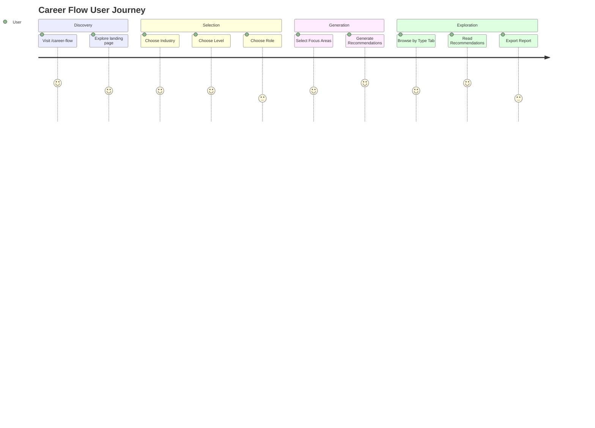

# 02_Career_Flow.md — Career Flow & Career Progression Engine

## Project Overview

- **Project Name:** NearbyHiring — AI-Powered Job & Career Platform
- **Module Name:** Career Flow (Career Progression & Career Intelligence Generator)
- **Current Completion Status:** 90% Complete (Phase 2)
- **Technology Stack:** React 18, TypeScript 5, Vite 5, Tailwind CSS v4, Framer Motion, React Flow, Dagre, Lucide Icons
- **Primary Entry File:** `src/pages/CareerFlow.tsx` (1921 lines)
- **Primary Route:** `/career-flow`
- **Supporting Routes:** `/career-flow/generator`, `/career-flow-embed/:id`, `/career-flow-strip/:id`, `/career-flow-admin/:jobId`
- **Backend:** PHP (`backend/api/career_flow.php`, `backend/includes/career_flow_engine.php`)
- **Database:** MySQL (`career_nodes`, `career_edges`, `career_flow_cache`)
- **Python Scripts:** `scripts/extract_career_data.py`, `data/generate_international_salaries.py`
- **JSON Datasets:** `data/master_career_paths.json`, `data/salary_benchmarks.json`, `public/data/career_intelligence/*.json`
- **Auto-generated TS:** `src/data/careerIndex.ts` (5809 lines)

---

## Purpose

Career Flow provides interactive visual career progression diagrams for Indian job seekers. It maps the complete journey from entry-level to leadership positions within any industry, showing main pathways, alternate routes, lateral moves, and international opportunities.

### Business Goal

Democratize career intelligence by making professional growth paths visible and understandable for every Indian worker — from ITI graduates to software engineers — so they can plan their career trajectory with confidence.

### Problem Solved

Career progression is opaque in most Indian industries. Employees don't know:
- What the next logical career step is
- How long each level typically takes
- What skills are needed to advance
- What alternate career paths exist
- What international opportunities match their profile

### Target Users

- Students exploring career options
- Entry-level workers planning first promotion
- Mid-career professionals seeking advancement
- Career switchers exploring lateral moves
- Professionals considering international relocation
- HR/talent managers building career frameworks

---

## Features

| Feature | Description | Status |
|---------|-------------|--------|
| Career Flow Landing Page | Marketing page with industry grid, testimonials, how-it-works | Complete |
| Career Intelligence Generator | Generate 14 types of career recommendations | Complete |
| Interactive Career Graph | React Flow-based career diagram with 3 node types | Complete |
| Career Progression Board | 6-lane interactive board with SVG bezier connections | Complete |
| Main Pathway Timeline | Zig-zag timeline of primary career progression | Complete |
| Alternate Pathway Cards | Grid of lateral and cross-industry transitions | Complete |
| International Pathway Cards | Country-specific career data with visa info | Complete |
| Career Ladder | Vertical/horizontal level ladder with role mapping | Complete |
| Career Details Drawer | Slide-out panel with salary, skills, progression | Complete |
| Premium Career Canvas | Canvas/timeline hybrid view with scroll tracking | Complete |
| Student Career Flow Strip | Mobile-friendly horizontal draggable strip | Complete |
| Career Industry Grid | Industry selection with search and sector filter | Complete |
| Embeddable Flow Pages | Standalone embeddable career flow views | Complete |
| Admin Career Flow Editor | Admin interface for editing career graph data | Complete |
| PDF Export | Generate career flow reports | Partial |

---

## Complete User Flow

```
User visits /career-flow
  → Landing page with hero, rotating text, industry highlights
  → Testimonials row, why-use cards, how-it-works
  → Click "Explore Career Flow" or industry card
    → /career-flow/generator or /career-atlas

OR

User visits /career-flow/generator
  → sidebar: select Industry → Level → Role → Focus Areas (multi-select)
  → Click "Generate Career Intelligence"
    → Ticker animation (9 steps)
    → Skeleton shimmer
    → Results: paginated recommendations with 14-type tab filter
    → Can export as .txt report
```

## Screen Flow

```
CareerFlow.tsx (landing)
├── Hero with rotating texts (6)
├── Why Choose section (5 zigzag cards)
├── Why Use section (6 cards with badges)
├── Roadmap steps (8-step journey)
├── Career progression ladder (9-level illustration)
├── Lateral industry moves (3 domains)
├── How it works (6 steps)
├── Testimonials (3 rows × 4, multi-track scroller)
├── International sector (50 country entries)
└── FAQ section

CareerFlowGenerator.tsx (generator)
├── Sidebar panel
│   ├── Industry select (29 industries)
│   ├── Level select (6 levels)
│   ├── Role select (from industry+level)
│   └── Focus areas (14 checkboxes)
├── Stats bar (roles, industries, levels, path types)
├── Results area
│   ├── Empty state → Ticker animation → Skeleton → Results
│   ├── Tab filter (15 types)
│   └── Paginated cards (25/page)
└── Export button (.txt report)
```

## Navigation Flow

```
/ → /career-flow → hero CTAs → /career-flow/generator or /career-atlas
/ → /career-flow → industry card click → /career-atlas
/ → Navbar → Career Flow dropdown → /career-flow | /career-flow/generator
/ → /career-flow-embed/:id → standalone embed
/ → /career-flow-strip/:id → strip embed
/admin → Career Flow → /career-flow-admin/:jobId
```

## UI Flow

```
CareerFlow Landing:
1. Hero with animated text rotation
2. Scrolling testimonial rows (horizontal, infinite)
3. Zigzag cards explaining benefits
4. Roadmap steps (education → leadership)
5. Lateral industry domain cards
6. How-it-works step cards
7. Country grid (50 entries)
8. FAQ accordion
9. Footer

CareerFlow Generator:
1. Left sidebar opens with matrix form
2. 3 cascading dropdowns (industry → level → role)
3. 14 focus area checkboxes
4. Generate button triggers animation sequence
5. Results populate with tab bar (all/promotion/lateral/etc.)
6. Pagination (25/50/100 per page)
7. Export as .txt button
```

## Backend Flow

```
GET /api/career_flow.php?industry=X&career_level=Y&job_title=Z
  → 1. Load career_roles.json, salary_benchmarks.json, career_competencies.json, international_salaries.json
  → 2. Normalize industry name (alias mapping: 11 aliases)
  → 3. Match career level (fuzzy)
  → 4. Generate MD5 cache key
  → 5. Check career_flow_cache table (30-day TTL)
  → 6. If cached: return response_json
  → 7. If not cached:
       a. Build main pathway: 6 levels × 2 stages each
       b. Build alternate pathways: 4 sibling roles
       c. Build international paths: 5 priority countries
       d. Build diagram nodes + edges
       e. Store in career_flow_cache (30-day expiry)
       f. Return CareerFlowResponse
```

## Frontend Flow

```
CareerFlowGenerator.tsx:
  1. Mount → load industry list from CAREER_INDUSTRIES
  2. On industry change → load levels
  3. On level change → load roles from ROLES_BY_INDUSTRY_LEVEL
  4. On role change → enable "Generate" button
  5. Generate click → validate fields → ticker animation → skeleton → call generateCareerIntelligence()
  6. Results → filter by activeTab → paginate → render recommendation cards
  7. Recommendation types: promotion, lateral, cross_industry, skill_gap, certification, salary, international, roadmap, succession, upskill, career_family, role_dependency, leadership_transition, emerging_career

CareerFlowPanel.tsx:
  1. Fetch data from career_flow.php via @tanstack/react-query
  2. 3 tabs: "Career Progression", "Alternate Pathways", "International Career"
  3. Loading → skeleton
  4. Error → error state
  5. Signed-in check → gate international paths
```

## Database Flow

### Tables

```sql
career_nodes:
  id INT PK AUTO_INCREMENT
  job_id INT (FK → jobs.id)
  node_key VARCHAR(50) UNIQUE(job_id, node_key)
  label VARCHAR(255)
  level ENUM('Entry','Supervisory','Middle','Executive','Higher','Leadership')
  pathway_type ENUM('Main','Alternate','International')
  salary_range VARCHAR(100)
  created_at TIMESTAMP

career_edges:
  id INT PK AUTO_INCREMENT
  job_id INT (FK → jobs.id)
  source_node VARCHAR(50)
  target_node VARCHAR(50)
  edge_type VARCHAR(50) DEFAULT 'smoothstep'
  created_at TIMESTAMP
  INDEX(job_id, source_node, target_node)

career_flow_cache:
  id INT PK AUTO_INCREMENT
  cache_key VARCHAR(255) UNIQUE
  industry VARCHAR(255)
  job_title VARCHAR(255)
  career_level VARCHAR(50)
  response_json LONGTEXT
  created_at TIMESTAMP
  expires_at TIMESTAMP
```

## Python Flow

### `scripts/extract_career_data.py`
- Reads JSON from `generated_output/json/`
- Outputs `careerIntelligenceData.ts` + `careerIndex.ts`

### `data/generate_international_salaries.py`
- 14 countries with currency/VISA/salary data
- Industry-country relevance mapping
- Role-level salary scaling

## JSON Structure

### CareerFlowResponse
```json
{
  "success": true,
  "job_numeric_id": 123,
  "job_title": "Software Engineer",
  "industry": "IT & Software Services",
  "career_level": "Middle Level",
  "main_pathway": [
    {
      "stage": 1,
      "role": "Junior Software Developer",
      "level": "Entry",
      "year_range": "0-2 years",
      "salary_min_lpa": 3.5,
      "salary_max_lpa": 6.0,
      "skills": ["Java", "SQL", "JavaScript"],
      "transition_note": "Focus on building core programming skills"
    }
  ],
  "alternate_pathways": [
    {
      "pivot_role": "QA Engineer",
      "industry_area": "IT & Software Services",
      "transition_requirement": "Learn testing frameworks",
      "timeline": "6-12 months",
      "salary_range": "4-7 LPA"
    }
  ],
  "international_pathways": [
    {
      "country": "USA",
      "role_equivalent": "Software Engineer",
      "currency_code": "USD",
      "salary_local": 95000,
      "salary_inr_approx": 78.85,
      "visa_pathway": "H-1B Visa"
    }
  ],
  "diagram": {
    "nodes": [...],
    "edges": [...]
  }
}
```

## Folder Structure

```
src/
├── pages/
│   ├── CareerFlow.tsx                   ← Landing page (1921 lines)
│   ├── CareerFlowGenerator.tsx          ← Generator tool (584 lines)
│   ├── CareerFlowEmbed.tsx              ← Embeddable flow (3090 lines)
│   ├── CareerFlowStripEmbed.tsx         ← Strip embed (3514 lines)
│   └── AdminCareerFlowEditor.tsx        ← Admin editor
├── components/CareerFlow/
│   ├── types.ts                         ← Core types
│   ├── index.ts                         ← Barrel exports
│   ├── CareerFlowBoard.tsx              ← Interactive board (586 lines)
│   ├── CareerDiagram.tsx                ← React Flow diagram (86 lines)
│   ├── CareerFlowNode.tsx               ← Custom node (64 lines)
│   ├── CareerFlowPanel.tsx              ← Data panel (117 lines)
│   ├── CareerLadder.tsx                 ← Level ladder (190 lines)
│   ├── CareerDetailsDrawer.tsx          ← Details drawer (255 lines)
│   ├── CareerIndustryGrid.tsx           ← Industry grid (156 lines)
│   ├── MainPathwayTimeline.tsx          ← Timeline (68 lines)
│   ├── AlternatePathwayCards.tsx        ← Lateral cards (26 lines)
│   ├── InternationalPathwayCards.tsx    ← International (137 lines)
│   ├── PremiumCareerCanvas.tsx          ← Canvas (145 lines)
│   ├── StudentCareerFlowStrip.tsx       ← Mobile strip (237 lines)
│   └── CareerFlowSkeleton.tsx           ← Skeletons (203 lines)
├── lib/
│   ├── careerAtlas.ts                   ← Data layer (342 lines)
│   ├── careerProceduralEngine.ts        ← Recommendation engine (766 lines)
│   └── career-path-engine.ts            ← Graph layout engine (639 lines)
├── data/
│   ├── careerIndex.ts                   ← Auto-generated index (5809 lines)
│   ├── careerIntelligenceData.ts        ← Auto-generated dataset (471K lines)
│   └── master_career_paths.json         ← Legacy dataset
backend/
├── api/career_flow.php                  ← API endpoint (52 lines)
├── includes/career_flow_engine.php      ← PHP engine (945 lines)
├── admin/career-flow-editor.php         ← Admin editor
└── admin/career-flow-overview.php       ← Admin overview
database/career_flow_schema.sql           ← DB schema
```

## Important Files

| File | Path | Role |
|------|------|------|
| CareerFlow.tsx | `src/pages/CareerFlow.tsx` | Marketing landing page |
| CareerFlowGenerator.tsx | `src/pages/CareerFlowGenerator.tsx` | Recommendation generator tool |
| career-path-engine.ts | `src/lib/career-path-engine.ts` | Graph layout engine |
| careerProceduralEngine.ts | `src/lib/careerProceduralEngine.ts` | Recommendation engine |
| careerAtlas.ts | `src/lib/careerAtlas.ts` | Data layer |
| careerIndex.ts | `src/data/careerIndex.ts` | 29-industry data index |
| CareerFlowBoard.tsx | `src/components/CareerFlow/CareerFlowBoard.tsx` | Interactive graph board |
| CareerFlowPanel.tsx | `src/components/CareerFlow/CareerFlowPanel.tsx` | Data panel container |
| CareerFlowNode.tsx | `src/components/CareerFlow/CareerFlowNode.tsx` | Custom React Flow node |
| CareerLadder.tsx | `src/components/CareerFlow/CareerLadder.tsx` | Level ladder component |
| CareerDetailsDrawer.tsx | `src/components/CareerFlow/CareerDetailsDrawer.tsx` | Detail drawer |
| CareerIndustryGrid.tsx | `src/components/CareerFlow/CareerIndustryGrid.tsx` | Industry grid |
| career_flow.php | `backend/api/career_flow.php` | PHP API |
| career_flow_engine.php | `backend/includes/career_flow_engine.php` | PHP engine (945 lines) |
| career_flow_schema.sql | `database/career_flow_schema.sql` | DB schema |

## Important APIs

| Endpoint | Method | Input | Output |
|----------|--------|-------|--------|
| `/api/career_flow.php` | GET | `job_id`, `industry`, `career_level`, `job_title` | CareerFlowResponse |

## Important Utilities

| Utility | File | Purpose |
|---------|------|---------|
| `detectCareerPath()` | `src/lib/career-path-engine.ts` | Fuzzy match industry + role |
| `buildLocalFallbackFlow()` | `src/lib/career-path-engine.ts` | Client-side fallback flow |
| `buildDiagramFromRecords()` | `src/lib/career-path-engine.ts` | Build React Flow elements |
| `layoutCareerDiagramElements()` | `src/lib/career-path-engine.ts` | Manual dagre layout |
| `generateCareerIntelligence()` | `src/lib/careerProceduralEngine.ts` | 14-type recommendation generator |
| `graphNodeFactory()` | `src/lib/career-path-engine.ts` | Create React Flow nodes |
| `career_flow_engine_generated_payload()` | `backend/includes/career_flow_engine.php` | PHP pathway generation |

## Application Logic

### Career Flow Generator (14 Recommendation Types)

| Type | Description | Template Count |
|------|-------------|---------------|
| promotion | Natural advancement paths | 6 |
| lateral | Adjacent role transitions | 6 |
| cross_industry | Industry-to-industry moves | 6 |
| skill_gap | Gap analysis with timeline | 6 |
| certification | Cert recommendations | 6 |
| salary | Salary benchmarks | 6 |
| international | Global opportunities | 6 |
| roadmap | Phased learning plans | 6 |
| succession | Organization succession planning | 4 |
| upskill | Future-proofing recommendations | 4 |
| career_family | Career cluster analysis | 3 |
| role_dependency | Prerequisite analysis | 3 |
| leadership_transition | IC-to-leader mindset shift | 3 |
| emerging_career | High-growth emerging fields | 3 |

### CareerFlowBoard BFS Logic
- When role selected, BFS traverses forward (promotions) AND backward (previous roles)
- Reachable nodes get highlighted, non-reachable get dimmed
- SVG Bezier curves drawn between connected roles
- 6 horizontal lanes with color-coded level columns

### CareerFlowPanel Data Fetching
- Uses `@tanstack/react-query` with `useQuery`
- Fetches from `career_flow.php?industry=X&career_level=Y&job_title=Z`
- Falls back to `buildLocalFallbackFlow()` if backend unavailable
- 3 tabs: Progression, Alternate, International
- Auth-gated: International tab requires signed-in user

## Rendering Logic

- **CareerDiagram**: React Flow with dark theme, 3 node types (entry/mid/leadership), minimap + controls
- **CareerFlowBoard**: 6 horizontal lanes, SVG bezier connections, BFS path highlighting
- **MainPathwayTimeline**: Alternating left/right layout with scroll-linked animations
- **CareerLadder**: 2x2 grid (desktop) or vertical stack (mobile), auth-gated levels
- **StudentCareerFlowStrip**: Horizontal draggable with momentum scrolling, Hindi tooltip
- **PremiumCareerCanvas**: Timeline (scroll-driven progress fill) or card grid, level tones cyan→fuchsia

## Search Logic

- Industry search: text match on industry name
- Role search: text match on role title within CareerFlowBoard
- Sector filter: All / Core / Emerging

## Filtering Logic

- **CareerFlowGenerator**: Tab filter for 14 recommendation types, pagination
- **CareerFlowPanel**: Tab switch between progression/alternate/international
- **CareerLadder**: Auth-gate truncation at Middle Level
- **CareerIndustryGrid**: Sector filter (All/Core/Emerging)

## State Management

### CareerFlowGenerator.tsx:
```typescript
industry, level, role, roleId: string
availableRoles: string[]
focusAreas: string[] (multi-select, 14 options)
isSidebarOpen, isGenerating, showSkeleton: boolean
tickerLogs: string[]
activeTab: string (15 options)
recommendations: CareerRecommendation[]
currentPage: number
```

### CareerFlow.tsx (landing page):
```typescript
activeStarTab: 'S' | 'T' | 'A' | 'R'
currentBannerVideoIndex: number
currentShowcaseIndex: number
activeSubTab: string
activeStepIndex: number
rotatingTextIndex: number
```

## Local Storage

| Key | Content | Purpose |
|-----|---------|---------|
| `nearby_atlas_bookmarks` | `string[]` | Bookmarked roles |
| `AI_SOURCE_KEY` | string | AI dashboard source tracking |

## Session Usage

- PHP session cookie for auth status
- Guest session tokens for unauthenticated users
- Career flow cache uses MD5 cache key

## Future Scalability

- Can add more industries (currently 29) — add data to JSON + careerIndex.ts
- More international countries (currently 14) — add via Python generator
- More recommendation types (currently 14) — add templates + tab in generator
- Embed variants: CareerFlowEmbed and CareerFlowStripEmbed already support generic IDs

## Performance Notes

- CareerFlowBoard uses memoized BFS — good for ~600 nodes
- CareerFlowPanel uses React Query caching with 30-day backend cache
- Skeleton shimmer during data load (1.5s)
- StudentCareerFlowStrip uses pointer events + momentum, touch-optimized

## Dependencies

- `reactflow` + `dagre` — Graph layout and diagram rendering
- `framer-motion` — Scroll animations, stagger, transitions
- `@tanstack/react-query` — Server data caching
- `lucide-react` — Icons
- `react-router-dom` — Routing (including embed routes)

## Known Limitations

1. Generated pathways are rule-based, not from real career data
2. International salary data is estimated (market averages)
3. CareerFlowBoard does not persist user interactions
4. Generator results are client-side only (no backend save)
5. 14 recommendation types are template-based, no ML

## Future Improvements

1. **Real career data integration** via job posting history and professional profiles
2. **ML-based path prediction** using actual career trajectories
3. **User progress tracking** with saved career plans
4. **Company-specific career ladders** integrated with job listings
5. **Salary API integration** for real-time market rates
6. **Mobile app** with push notifications for career milestones
7. **Admin dashboard** with analytics on popular career paths

---

## Architecture Diagram (Mermaid)

```mermaid
flowchart TD
    subgraph Frontend Pages
        CF[CareerFlow.tsx<br/>Landing] --> GEN[CareerFlowGenerator.tsx]
        CF --> CA[CareerAtlas.tsx]
        GEN --> PE[careerProceduralEngine.ts]
    end
    subgraph Components
        CFB[CareerFlowBoard.tsx] --> BFS[BFS Path Finding]
        CD[CareerDiagram.tsx] --> RF[React Flow]
        CL[CareerLadder.tsx] --> LG[Auth Gate Logic]
        CDD[CareerDetailsDrawer.tsx]
        IPC[InternationalPathwayCards.tsx]
    end
    subgraph Engine
        PE --> CI[careerIndex.ts]
        PE --> JSON[JSON Datasets]
        CPE[career-path-engine.ts] --> DAGRE[dagre Layout]
    end
    subgraph Backend
        API[career_flow.php] --> ENG[career_flow_engine.php]
        ENG --> DB[(MySQL Cache)]
        ENG --> JSON2[JSON Datasets]
    end
    Frontend Pages --> |data fetch| Backend
```

## Data Flow Diagram (Mermaid)

```sequenceDiagram
    participant U as User
    participant G as CareerFlowGenerator
    participant PE as careerProceduralEngine
    participant CI as careerIndex.ts
    participant JSON as JSON Datasets

    U->>G: Select Industry
    G->>CI: get industries
    CI-->>G: 29 industries
    U->>G: Select Level
    G->>CI: getRolesForIndustry(industry, level)
    CI-->>G: role list
    U->>G: Select Role
    U->>G: Select Focus Areas (14 types)
    U->>G: Click "Generate"
    G->>PE: generateCareerIntelligence(industry, level, role, focusAreas)
    PE->>JSON: career_roles.json, relationships.json, competencies.json
    JSON-->>PE: datasets
    PE->>PE: Filter relationships by type
    PE->>PE: Match competencies
    PE->>PE: Render 50+ template variants
    PE-->>G: CareerRecommendation[]
    G->>G: Filter by activeTab
    G->>G: Paginate (25/page)
    G-->>U: Render recommendation cards
```

## User Journey (Mermaid)



---

## AI Model Context

### Architecture Overview
Career Flow is a **two-layer system**: a marketing landing page (`CareerFlow.tsx`) and a production generator tool (`CareerFlowGenerator.tsx`). The generator uses `careerProceduralEngine.ts` to produce 14 types of career recommendations from static JSON datasets, relying on template-based text generation (50+ templates).

### Dependencies
- **Critical:** `careerProceduralEngine.ts`, `career-path-engine.ts`, `careerIndex.ts`
- **UI:** 15 components in `src/components/CareerFlow/`
- **Data:** 6 JSON files in `public/data/career_intelligence/`
- **Layout:** React Flow + Dagre

### Things That Must Never Be Changed
1. The `CareerRecommendation` type structure (14 type identifiers)
2. The `CAREER_INDUSTRIES` array (used by CareerFlowGenerator, CareerFlowBoard, CareerIndustryGrid)
3. The dagre layout direction constants (LR/TB)
4. The BFS traversal logic in CareerFlowBoard

### Reusable Components
- `CareerDetailsDrawer` — Generic slide-out drawer
- `CareerIndustryGrid` — Industry grid with search/filter
- `CareerLadder` — Level progression visualization
- `CareerFlowSkeleton` — 6 loading variants

### Critical Files
- `src/lib/careerProceduralEngine.ts` — Core recommendation engine (766 lines, 50+ templates)
- `src/lib/career-path-engine.ts` — Graph layout engine (639 lines)
- `src/pages/CareerFlowGenerator.tsx` — Generator page (584 lines)
- `src/components/CareerFlow/CareerFlowBoard.tsx` — Most complex component (586 lines)

### Safe Modification Areas
- Adding new template texts in careerProceduralEngine.ts
- Styling changes in CareerFlow components
- Adding new focus areas to the generator
- Extending embed pages with new layouts

### Danger Areas
- Removing auth gate without backend integration
- Changing the ROLES_BY_INDUSTRY_LEVEL key format
- Modifying the BFS algorithm in CareerFlowBoard
- Changing React Flow node type registration

### Future Extension Points
1. Add ML model output to `generateCareerIntelligence()`
2. Connect CareerFlowBoard to live API for real career data
3. Add drag-to-rearrange for admin curation
4. Add career plan saving to user accounts
5. Integrate with job matching API

---

## PPT Generation Context

### Executive Summary
Career Flow is an interactive career progression intelligence system that generates visualized career pathways across 29 Indian industries. It combines a React Flow graph engine, a 14-type recommendation system, and a PHP backend to deliver promotion paths, lateral moves, skill gap analysis, and international opportunities.

### Problem
Career progression is invisible in most Indian industries. Employees don't know their next logical step, required skills, timeline, or alternate paths.

### Solution
An interactive visualization system that generates personalized career pathways — including promotions, lateral moves, skill gaps, certifications, international opportunities, and more — presented through intuitive diagrams and recommendation cards.

### Architecture
- **Frontend:** React 18 + TypeScript + Tailwind CSS v4 + React Flow + Dagre
- **Engine:** Procedural career intelligence engine with 50+ template variants
- **Backend:** PHP career flow engine with MySQL caching (30-day TTL)
- **Data:** Pre-generated JSON datasets + auto-generated TypeScript indexes
- **Python:** Data extraction and international salary generation

### Workflow
1. User selects industry → level → role + focus areas
2. Engine loads career relationships and competencies
3. Templates render with skill/competency/salary placeholders
4. Results presented in tab-filtered, paginated cards

### Technology
React 18, TypeScript, React Flow, Dagre, Framer Motion, TanStack Query, PHP 8, MySQL, Python 3

### Features (15 total)
Generator with 14 recommendation types, interactive board, timeline, ladder, lateral analysis, international pathways, detail drawer, embeddable views, auth-gated content, admin editor

### Advantages
- Fully client-side generation (works offline)
- 29 industries, 1310 roles, 160K relationships
- 14 distinct recommendation types
- Embeddable for external sites
- Admin curation interface

### Future Scope
ML-based predictions, real-world career data integration, user career plans, company-specific ladders, mobile app
