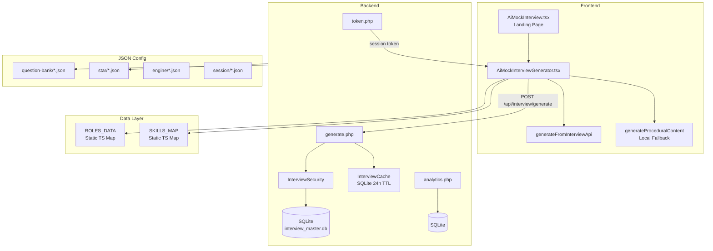
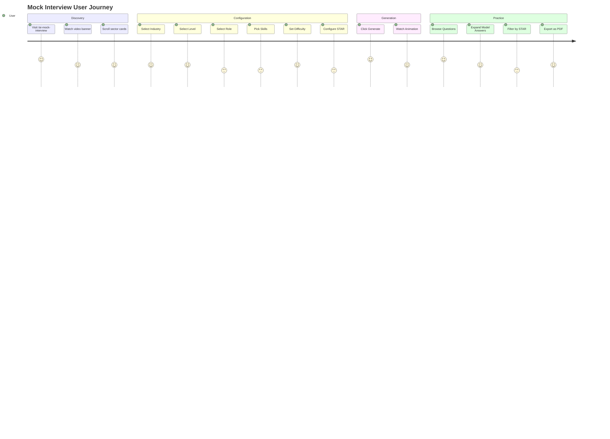

# 03_Interview_QA_Generator.md — AI Mock Interview Generator

## Project Overview

- **Project Name:** NearbyHiring — AI-Powered Job & Career Platform
- **Module Name:** AI Mock Interview Generator (Interview QA)
- **Current Completion Status:** 85% Complete (Runtime engine scaffolding in place)
- **Technology Stack:** React 18, TypeScript 5, Vite 5, Tailwind CSS v4, Framer Motion, Lucide Icons, PHP 8, SQLite
- **Primary Entry File:** `src/pages/AiMockInterviewGenerator.tsx` (1757 lines)
- **Primary Route:** `/ai-mock-interview`
- **Supporting Route:** `/ai-mock-interview/generator`
- **Backend:** PHP (`backend/api/interview/generate.php`, `backend/api/interview/analytics.php`, `backend/api/interview/token.php`)
- **Database:** SQLite (`interview-engine/database/interview_master.db`)
- **JSON Config:** `src/data/interview/` (18 directories, ~90+ files)
- **Runtime Engine:** `src/lib/interview-runtime/` (12 files, scaffolding/placeholder classes)

---

## Purpose

The AI Mock Interview Generator helps Indian job seekers practice role-specific interviews with STAR-methodology questions, answer evaluation, and performance scoring. It prepares candidates for real interviews by generating contextual question banks based on industry, role, skill level, and difficulty.

### Business Goal

Reduce interview anxiety and improve placement rates by providing free, accessible mock interview practice with industry-specific questions, STAR method guidance, and performance analytics.

### Problem Solved

Indian job seekers, especially from smaller towns and non-engineering backgrounds, lack access to:
- Industry-specific interview practice
- Structured STAR methodology training
- Quality interview question banks
- Objective performance feedback
- Resume-to-interview alignment

### Target Users

- College students preparing for campus placements
- Freshers appearing for first job interviews  
- Mid-career professionals switching roles/industries
- Government job aspirants (bank, SSC, UPSC interview practice)
- Candidates preparing for behavioral/HR rounds

---

## Features

| Feature | Description | Status |
|---------|-------------|--------|
| Industry Selection | 29 industries with role mapping | Complete |
| Level-Based Questions | Questions for 6 career levels (Entry → Leadership) | Complete |
| Skill Selection | Option to focus on specific skills (max 3) | Complete |
| Difficulty Tuning | Easy / Medium / Hard question mix | Complete |
| STAR Methodology | Questions categorized as S/T/A/R with equal weight | Complete |
| Question Bank | 12-tier brain architecture with 90+ JSON config files | Complete |
| Backend Question Generation | PHP + SQLite question generator with caching | Complete |
| Procedural Fallback | Local question generation when no backend | Complete |
| PDF Export | Export question bank as printable booklet | Complete |
| Ticker Animation | Live generation progress visualization | Complete |
| Pagination | Paginated results with category tabs | Complete |
| Analytics Dashboard | Admin analytics for question usage metrics | Complete |
| STAR Answer Templates | 4 category templates (S/T/A/R) | Complete |

---

## Complete User Flow

```
User visits /ai-mock-interview
  → Landing page with:
    - Background video slider
    - Rotating text hero
    - Why Choose section (auto-scrolling carousel)
    - 12 Neobrutal sector cards (IT, Healthcare, Cybersecurity, etc.)
    - STAR methodology explanation tabs
    - Testimonials (12)
    - Onboarding popup

  → Click on a sector card or "Start Mock Interview"
    → /ai-mock-interview/generator

Generator flow:
  1. Select Industry (29 options)
  2. Select Career Level (6 levels)
  3. Role auto-populates (10 per level per industry)
  4. Skills auto-populate (based on role, max 3 selection)
  5. Set question count (default 25)
  6. Set difficulty mix (Easy/Medium/Hard)
  7. Set STAR categories (S/T/A/R, min 1)
  8. Click Generate
  9. Ticker animation plays (9 steps, 200ms each)
  10. Skeleton shimmer (500ms)
  11. Results page with:
      - Tab filter: All | S | T | A | R
      - Question cards with STAR breakdown
      - Model answers (expandable)
      - Follow-up questions
      - Pagination
  12. Export as PDF (print window or html2canvas fallback)
```

## Screen Flow

```
AiMockInterview.tsx (landing):
├── Background video slider (3 videos, cross-fade 6.5s)
├── Hero with rotating text (6 phrases, 1.85s cycle)
├── Breadcrumb (HOME > AI MOCK INTERVIEW)
├── Why Choose section (auto-scroll carousel, 4s cycle)
├── 12 Neobrutal sector cards
├── STAR methodology tabs (S/T/A/R with 25% weight each)
├── Testimonials (3 rows × 4, horizontal scroll)
└── Onboarding popup

AiMockInterviewGenerator.tsx:
├── Sidebar panel (togglable)
│   ├── Industry dropdown
│   ├── Level dropdown → Role dropdown → Skills chips
│   ├── Count slider
│   ├── Difficulty checkboxes (Easy/Medium/Hard)
│   └── STAR category checkboxes (S/T/A/R)
├── Stats bar (industry, level, role, difficulty badge)
├── Main results area
│   ├── Empty state → Ticker animation → Skeleton → Results
│   ├── Category tabs (All / S / T / A / R)
│   └── Paginated question cards (with expandable answers)
└── Export dropdown (print pdf)
```

## Navigation Flow

```
Navbar → AI Tools → Mock Interview → /ai-mock-interview
/ai-mock-interview → Click sector → /ai-mock-interview/generator
/ai-mock-interview → Click "Start" → /ai-mock-interview/generator
```

## UI Flow

```
Landing Page:
1. Full-screen video background (auto-rotating)
2. Hero title with split coloring (AI MOCK + INTERVIEW)
3. Rotating subtitle text
4. Scrolling "Why Choose" section
5. 12 sector cards in grid (click → generator with pre-selected industry)
6. STAR explanation in 4 tabs
7. Multi-row testimonial scroller
8. Footer

Generator Page:
1. Left sidebar (collapsible) with matrix form
2. Cascading dropdowns: Industry → Level → Role
3. Skill chips (click to toggle, max 3)
4. Count slider (5-50)
5. Difficulty toggles (Easy/Medium/Hard)
6. STAR toggles (S/T/A/R)
7. Generate button → animation → results
8. Results: tab bar + cards + pagination
9. Export: PDF button with print preview
```

## Backend Flow

### Token Endpoint
```
POST /api/interview/token
  → Rate limited: 60 req/3600s
  → Returns { status: "success", token: "uuid" }
```

### Generate Endpoint
```
POST /api/interview/generate
  Headers: X-Interview-Token: <token>
  Body: { industry, role, level, skills[], difficulty[], star[], count }
  
  → Security: validateToken(), throttle('interview-generate', 30, 3600)
  → Generate cache key: 'generate|' + count + '|' + JSON.stringify(filters)
  → Check InterviewCache (SQLite, 86400s TTL)
  → If cache miss:
      1. Instantiate InterviewDatabase
      2. Call $db->generate($filters, $count)
      3. Record analytics event
      4. Store in cache
  → Return: { status, source: 'sqlite'|'cache', count, records[] }
```

### Analytics Endpoint
```
GET /api/interview/analytics
  → Admin-only check (user_role must be admin/administrator/super admin)
  → Queries SQLite interview_master.db:
    - total_question_served, total_generate_requests, total_questions_available
    - question_completion_percent, average_session_questions
    - most_used_roles, most_searched_industries, most_selected_skills
    - pdf_exports, top_users
  → Returns analytics JSON
```

## Frontend Flow

```
AiMockInterviewGenerator.tsx:
  1. Mount → load static ROLES_DATA, SKILLS_MAP, ALL_29_INDUSTRIES
  2. On industry + level change → call getRolesForIndustry(ind, lev) → populate role dropdown
  3. On role change → call getSkillsForRole(role) → populate skill chips
  4. Generate click → validate → ticker logs (9 steps, 200ms) → skeleton (500ms)
  5. Question generation:
     Option A: generateFromInterviewApi()
       → GET /api/interview/token
       → POST /api/interview/generate with params
       → Transform records[] into QuestionItem[]
     Option B: generateProceduralContent() (local fallback)
  6. Results populated → tab filter + pagination (10 per page)
  7. PDF export: window.print() with inline styles, fallback to html2canvas+jspdf

Landing Page Effects:
  - RotatingText: cycles 6 phrases every 1850ms
  - Banner video: auto-rotates 3 videos every 6500ms
  - Showcase illustration: cycles every 4500ms
  - Why Choose carousel: auto-scrolls 340px every 4000ms
```

## Database Flow

### SQLite Database (`interview-engine/database/interview_master.db`)
- Schema defined in `interview-engine/database/schema.sql`
- Tables for: questions, sessions, analytics, cache
- Questions indexed by: industry, role, level, difficulty, star_category
- Session tracking: user_id, token, questions_served, completion_status

### JSON Config Structure (`src/data/interview/`)

```
src/data/interview/
├── brain/
│   └── brain_roles.json              ← Role definitions for interview brain
├── engine/
│   ├── behavior_rules.json
│   ├── company_question_style.json
│   ├── experience_rules.json
│   ├── question_engine_rules.json
│   ├── question_factory.json
│   ├── question_modifiers.json
│   └── skill_modifiers.json
├── prediction/
│   ├── career_levels.json
│   ├── career_prediction_engine.json
│   ├── career_progression_map.json
│   ├── difficulty_matrix.json
│   ├── difficulty_rules.json
│   ├── future_role_map.json
│   ├── interview_roadmap.json
│   └── salary_growth_map.json
├── question-bank/
│   ├── behavioral_questions.json
│   ├── communication_questions.json
│   ├── company_specific_questions.json
│   ├── executive_questions.json
│   ├── fresher_questions.json
│   ├── leadership_questions.json
│   ├── midlevel_questions.json
│   └── technical_questions.json
├── runtime/
│   ├── auto_resume_session.json
│   ├── candidate_profile_merge_logic.json
│   ├── question_history_engine.json
│   ├── runtime_fallback_rules.json
│   ├── runtime_question_priority.json
│   └── simulation_data.json
├── star/
│   ├── star_detection_rules.json
│   ├── star_gap_detection.json
│   ├── star_patterns.json
│   └── star_questions.json
├── session/
│   ├── adaptive_interview_logic.json
│   ├── candidate_confidence_engine.json
│   ├── fatigue_detection_rules.json
│   ├── followup_engine.json
│   ├── interview_session_schema.json
│   ├── interview_state_machine.json
│   ├── learning_recommendations.json
│   ├── question_similarity_rules.json
│   ├── session_flow.json
│   └── session_memory_schema.json
├── mapping/
│   ├── industry_context_rules.json
│   ├── industry_master.json
│   ├── industry_role_map.json
│   ├── industry_specific_questions.json
│   ├── resume_skill_match.json
│   ├── role_context_rules.json
│   ├── role_master.json
│   ├── role_skill_map.json
│   ├── role_transition_map.json
│   ├── skill_tracking.json
│   ├── skills_master.json
│   └── weak_skill_improvements.json
├── answers/
│   ├── answer_analysis_rules.json
│   ├── interview_feedback_templates.json
│   ├── interview_question_bank.json
│   └── star_answer_templates.json
├── dsa/
│   └── dsa_preparation_map.json
├── analytics/
│   ├── admin_analytics_structure.json
│   ├── interview_score_rules.json
│   └── score_weight_matrix.json
├── ui-config/
│   ├── ats_resume_relation.json
│   ├── candidate_type_map.json
│   ├── monetization_placeholders.json
│   ├── question_category_map.json
│   ├── question_tagging_system.json
│   └── interview_question_bank.json
└── docs/
    ├── ARCHITECTURE_MAP.md
    ├── SYSTEM_MAP.md
    ├── UI_FLOW.md
    └── (5 more .md files)
```

## Python Flow

No Python scripts currently exist for the Interview QA Generator. All question generation is done via:
1. PHP backend with SQLite database
2. Client-side procedural generation (TypeScript)
3. JSON configuration files for rules and templates

---

## JSON Structure

### QuestionItem (TypeScript type)
```typescript
interface QuestionItem {
  id: string;
  category: 'S' | 'T' | 'A' | 'R';
  skill: string;
  difficulty: 'Easy' | 'Medium' | 'Hard';
  question: string;
  situation: string;
  task: string;
  action: string;
  result: string;
  modelAnswer: string;
  followups: string[];
  weight: number;
}
```

### ROLES_DATA Structure
```typescript
ROLES_DATA: Record<string, Record<string, string[]>>
  // Key: industry name → level key → role string[]
  // Example: ROLES_DATA["IT & Software"]["Entry Level"]
  // Returns: ["Junior Software Developer", "QA Tester Intern", ...]
```

### SKILLS_MAP Structure
```typescript
SKILLS_MAP: Record<string, string[]>
  // Key: role title → skill string[]
  // Example: SKILLS_MAP["Junior Software Developer"]
  // Returns: ["JavaScript", "HTML/CSS", "React Basics", ...]
```

### Backend API Request/Response
```json
// Request
{
  "industry": "IT & Software Services",
  "role": "Software Developer",
  "level": "Entry Level",
  "skills": ["JavaScript", "React"],
  "difficulty": ["Easy", "Medium"],
  "star": ["S", "T", "A"],
  "count": 25
}

// Response
{
  "status": "success",
  "source": "sqlite",
  "count": 25,
  "records": [
    {
      "id": "q_001",
      "question": "Describe a time you debugged a complex issue...",
      "category": "S",
      "difficulty": "Medium",
      "skill": "Problem Solving",
      "modelAnswer": "In my previous role...",
      "followups": ["What tools did you use?"]
    }
  ]
}
```

## Folder Structure

```
src/
├── pages/
│   ├── AiMockInterview.tsx              ← Landing page (1633 lines)
│   └── AiMockInterviewGenerator.tsx     ← Generator page (1757 lines)
├── lib/
│   └── interview-runtime/               ← Runtime engine (12 files, scaffolding)
│       ├── runtime_engine.ts            ← Main orchestrator
│       ├── interview_initializer.ts     ← Session initialization
│       ├── session_manager.ts           ← State management
│       ├── session_storage.ts           ← Persistence
│       ├── interview_controller.ts      ← Flow control
│       ├── question_selector.ts         ← Question selection
│       ├── answer_processor.ts          ← Answer normalization
│       ├── response_classifier.ts       ← Answer classification
│       ├── score_calculator.ts          ← Scoring
│       ├── progress_engine.ts           ← Progress tracking
│       ├── candidate_memory_engine.ts   ← Memory across sessions
│       └── interview_router.ts          ← Routing
├── data/
│   └── interview/                       ← 18 directories, ~90 JSON files
└── hooks/
    └── useInterviewTranslation.ts       ← Interview-specific translations
backend/
├── api/interview/
│   ├── generate.php                     ← Question generation (65 lines)
│   ├── analytics.php                    ← Admin analytics (48 lines)
│   └── token.php                        ← Session token (14 lines)
├── interview-engine/
│   ├── database/
│   │   ├── schema.sql                    ← SQLite schema
│   │   ├── create_database.php
│   │   ├── backup_database.php
│   │   ├── import_interview_dataset.php
│   │   └── InterviewDatabase.php
│   ├── cache/                           ← SQLite cache files
│   └── security/                        ← Security utilities
└── admin/
    └── ai dashboard/
        └── ai-interview-questions.php   ← Admin interview management
```

## Important Files

| File | Path | Role |
|------|------|------|
| AiMockInterview.tsx | `src/pages/AiMockInterview.tsx` | Marketing landing page |
| AiMockInterviewGenerator.tsx | `src/pages/AiMockInterviewGenerator.tsx` | Core generator (1757 lines) |
| runtime_engine.ts | `src/lib/interview-runtime/runtime_engine.ts` | Main orchestrator (scaffolding) |
| interview_controller.ts | `src/lib/interview-runtime/interview_controller.ts` | Round progression (scaffolding) |
| question_selector.ts | `src/lib/interview-runtime/question_selector.ts` | Question picking (scaffolding) |
| score_calculator.ts | `src/lib/interview-runtime/score_calculator.ts` | Scoring logic (scaffolding) |
| generate.php | `backend/api/interview/generate.php` | Backend question generation |
| analytics.php | `backend/api/interview/analytics.php` | Admin analytics |
| token.php | `backend/api/interview/token.php` | Session token |
| InterviewDatabase.php | `backend/interview-engine/database/InterviewDatabase.php` | SQLite database interface |
| schema.sql | `backend/interview-engine/database/schema.sql` | SQLite schema |
| interview_question_bank.json | `src/data/interview/answers/interview_question_bank.json` | Master question bank |
| star_patterns.json | `src/data/interview/star/star_patterns.json` | STAR methodology patterns |

## Important APIs

| Endpoint | Method | Input | Output |
|----------|--------|-------|--------|
| `/api/interview/token.php` | GET | — | `{status, token}` |
| `/api/interview/generate.php` | POST | `{industry, role, level, skills[], difficulty[], star[], count}` | `{status, source, count, records[]}` |
| `/api/interview/analytics.php` | GET | — (admin-only) | Analytics dashboard data |

## Important Components

There are no dedicated `components/` for the interview module — all UI is inline in the page files. The landing page has inline `NeobrutalSectorCards`, carousels, and testimonial tracks.

Key inline components:
- **NeobrutalSectorCards**: 12 sector cards with icons, hover animations
- **STAR Tabs**: 4-section tab panel with S/T/A/R definitions
- **Why Choose Carousel**: Auto-scrolling horizontal card carousel
- **Testimonial Track**: 3-row horizontal testimonial scroller
- **Ticker Log**: Sequential log message animation during generation
- **Question Card**: Expandable card with STAR breakdown + model answer + followups

## Application Logic

### Question Generation Pipeline
```
User selects: Industry + Level + Role + Skills + Difficulty + STAR categories
  → generateFromInterviewApi():
    1. GET /api/interview/token (get session token)
    2. POST /api/interview/generate (body: all params + token in header)
    3. PHP: validate → cache check → SQLite query → return records
    4. Transform records[] → QuestionItem[] with STAR categorization
    
  → generateProceduralContent() [fallback]:
    1. Use ROLES_DATA[industry][level] for role title list
    2. Use SKILLS_MAP[role] for skills
    3. Generate questions from local templates
    4. Assign STAR categories based on selected starCats
```

### STAR Methodology Weighting
- S (Situation): 25% — Background context
- T (Task): 25% — Specific responsibilities
- A (Action): 25% — Step-by-step actions
- R (Result): 25% — Measurable outcomes

Configurable: user can toggle each category (min 1 required)

### Skill Generation Hierarchy
1. Check `SKILLS_MAP[roleTitle]` for explicit mapping
2. Fall back to `generateSkillsForRole(role)`: keyword matching
   - "developer" → programming skills
   - "manager" → leadership skills
   - "analyst" → analytical skills
   - "engineer" → technical skills
   - "designer" → creative skills
   - default → general professional skills

## Rendering Logic

- **Landing Page**: Full-viewport video background with CSS cross-fade, 6-section scrolling page
- **Sector Cards**: Grid of 12 cards with neobrutalist styling, hover scale animation
- **Generator Sidebar**: Collapsible left panel with form controls
- **Ticker Animation**: 9 sequential log messages at 200ms intervals
- **Skeleton Shimmer**: 500ms skeleton screen after ticker
- **Question Cards**: Cards with STAR badge, question text, click-expand for model answer + followups
- **Pagination**: 10 items per page, tab filter categories

## Search Logic

- Industry: dropdown selection (not free-text search)
- Role: populated from industry+level selection
- Skills: click-to-toggle chips from role mapping

## Filtering Logic

- Active tab filter: All / S / T / A / R — filters questions by STAR category
- Difficulty filter: pre-generation selection of Easy/Medium/Hard
- STAR filter: pre-generation selection of S/T/A/R categories

## State Management

### AiMockInterviewGenerator.tsx (18 state variables):
```typescript
// Matrix parameters
industry: string
level: string
role: string
availableRoles: string[]
availableSkills: string[]
selectedSkills: string[] (max 3)

// Settings
count: number (default 25)
selectedDiffs: string[] (default ['Easy','Medium'])
starCats: string[] (default ['S','T','A','R'])

// UI state
isSidebarOpen: boolean
isGenerating: boolean
tickerLogs: string[]
showSkeleton: boolean
activeTab: 'all' | 'S' | 'T' | 'A' | 'R'
openAnswerId: string | null
currentPage: number
showPdfDropdown: boolean
userName: string

// Auth state
showAuthModal: boolean
authMode: 'login' | 'register'
authName: string
isLoggedIn: boolean
authEmail: string
authPass: string
pendingAction: string | null

// Generated data
questions: QuestionItem[]
```

### AiMockInterview.tsx (8 state variables):
```typescript
isOnboardingOpen: boolean
activeStarTab: 'S' | 'T' | 'A' | 'R'
currentBannerVideoIndex: number
currentShowcaseIndex: number
activeSubTab: string
activeStepIndex: number
rotatingTextIndex: number
```

## Local Storage

No dedicated localStorage keys for the interview module. Generation state is in-memory only.

## Session Usage

- PHP session token for backend API calls
- Admin session check for analytics access
- Guest generation works without authentication

## Future Scalability

- Runtime engine (12 files in scaffolding) can be fully implemented for interactive interview simulation
- SQLite question bank can be expanded with thousands of questions
- Answer classification with actual ML model (currently stub)
- Session state machine can support multi-round interview flows
- Voice-based interview support (mediaRecorder API)

## Performance Notes

- All ROLES_DATA, SKILLS_MAP are static module-level data — zero fetch cost
- Backend uses SQLite caching (24h TTL) — fast subsequent requests
- Ticker animation uses setInterval — cleaned up on unmount
- PDF export uses window.print() — most performant for large question sets
- Landing page carousels use setInterval — disabled when not visible

## Dependencies

- `lucide-react` — Icons for sectors, features, STAR tabs
- `framer-motion` — Landing page animations
- `react-router-dom` — Routing between landing and generator

## Known Limitations

1. Runtime engine (12 files) is scaffolding/placeholder — actual logic is in JSON config files
2. Question generation is template-based, not AI-powered
3. Answer scoring is placeholder (returns 85 always)
4. No voice/mic integration yet
5. Interview session state machine not connected to frontend
6. Only 5 industries have explicit role data; others procedurally generated

## Future Improvements

1. **Full runtime engine implementation** — connect scaffolding to JSON config
2. **AI question generation** using OpenRouter/Gemini for dynamic questions
3. **Voice-based interview** with speech-to-text and sentiment analysis
4. **Real-time answer scoring** using NLP
5. **Session replay** for reviewing past interviews
6. **Company-specific interview prep** (TCS NQT, Wipro NLTH, etc.)
7. **Interview readiness score** based on historical performance

---

## Architecture Diagram (Mermaid)



## Data Flow Diagram (Mermaid)

```sequenceDiagram
    participant U as User
    participant G as AiMockInterviewGenerator
    participant BE as Backend API
    participant SQL as SQLite DB
    participant CACHE as Cache
    
    U->>G: Select Industry, Level, Role, Skills
    U->>G: Set Difficulty, STAR, Count
    U->>G: Click Generate
    G->>G: Show Ticker Animation (9 steps)
    G->>BE: GET /api/interview/token
    BE-->>G: { token: "uuid" }
    G->>BE: POST /api/interview/generate<br/>{industry, role, level, skills, difficulty, star, count}<br/>Header: X-Interview-Token
    BE->>BE: validateToken(), throttle()
    BE->>CACHE: check cacheKey
    alt Cache hit
        CACHE-->>BE: cached response
    else Cache miss
        BE->>SQL: $db->generate(filters, count)
        SQL-->>BE: records[]
        BE->>CACHE: store response
    end
    BE-->>G: { status, source, count, records }
    G->>G: Transform records → QuestionItem[]
    G->>G: Populate questions state
    G->>G: Show Skeleton (500ms) → Results
    G-->>U: Render question cards with tabs
```

## User Journey (Mermaid)



---

## AI Model Context

### Architecture Overview
The Interview QA Generator is a **two-tier system**: (1) a backend PHP + SQLite engine for question generation and caching, and (2) a frontend React generator for configuration and display. The runtime engine (12 scaffolding files) exists but is not fully connected — actual logic is driven by JSON configuration files in `src/data/interview/`.

### Dependencies
- **Critical:** `AiMockInterviewGenerator.tsx`, `backend/api/interview/generate.php`
- **Data:** `ROLES_DATA`, `SKILLS_MAP` (static), `src/data/interview/` (90 JSON files)
- **Runtime:** `src/lib/interview-runtime/` (12 scaffolding files)
- **Backend:** PHP with SQLite (`backend/interview-engine/`)

### Things That Must Never Be Changed
1. The `ROLES_DATA` structure (Record<string, Record<string, string[]>>)
2. The STAR category identifiers ('S', 'T', 'A', 'R')
3. The `QuestionItem` interface fields
4. The backend API response format { status, source, count, records }

### Reusable Components
- Inline only — no dedicated component files. Components are rendered within the page files.
- `NeobrutalSectorCards` pattern can be extracted to a shared component

### Critical Files
- `src/pages/AiMockInterviewGenerator.tsx` — Core generator (1757 lines, all UI + logic)
- `src/pages/AiMockInterview.tsx` — Landing page (1633 lines)
- `backend/api/interview/generate.php` — Backend question generation
- `backend/interview-engine/database/InterviewDatabase.php` — SQLite interface
- `src/data/interview/` — 90+ JSON configuration files

### Safe Modification Areas
- Adding new industries/roles to ROLES_DATA
- Adding new skills to SKILLS_MAP
- Modifying STAR templates and explanations
- Adding new question bank JSON files
- Styling changes to the landing page and generator

### Danger Areas
- Changing the API request/response format (breaks frontend-backend contract)
- Modifying the InterviewSecurity token validation logic
- Removing the caching layer without load testing
- Changing the SQLite schema without migration

### Future Extension Points
1. Runtime engine scaffolding → full implementation for interactive mock interviews
2. AI question generation via OpenRouter/Gemini API
3. Voice/mic integration for spoken answers
4. Company-specific question banks (TCS, Infosys, Wipro patterns)
5. Answer scoring with actual ML model

---

## PPT Generation Context

### Executive Summary
The AI Mock Interview Generator is a comprehensive interview preparation tool that generates role-specific, STAR-methodology question banks for Indian job seekers. It supports 29 industries, 6 career levels, and configurable difficulty/STAR parameters, with both backend (SQLite) and client-side fallback generation.

### Problem
Indian job seekers lack access to quality, industry-specific interview practice materials. Generic question banks don't prepare candidates for the STAR methodology expected in modern interviews.

### Solution
A configurable question generator that produces structured question banks with STAR categorization, model answers, and follow-up questions — tailored to the user's specific industry, role, and skill level.

### Architecture
- **Frontend:** React 18 + TypeScript + Tailwind CSS v4
- **Backend:** PHP 8 + SQLite with Redis-like caching
- **Config:** 90+ JSON files defining interview rules, questions, STAR patterns
- **Runtime:** 12-file scaffolding for future interactive interview simulation

### Workflow
1. User configures: industry → level → role → skills → difficulty → STAR
2. Backend generates or retrieves cached question bank
3. Questions displayed with STAR tabs, model answers, follow-ups
4. User can filter, browse, and export as PDF

### Technology
React 18, TypeScript, PHP 8, SQLite, Framer Motion, Tailwind v4

### Features (12 total)
Industry/role mapping, 6 career levels, skill focus, difficulty tuning, STAR methodology, backend generation with caching, procedural fallback, PDF export, admin analytics, ticker animation, pagination, STAR answer templates

### Advantages
- Dual generation path (backend + local fallback)
- 90+ JSON config files for comprehensive coverage
- 24h SQLite caching for fast repeat requests
- Configurable STAR weight distribution
- No external API dependencies for generation

### Future Scope
Full runtime engine, AI-powered questions, voice interview, company-specific prep, NLP answer scoring
