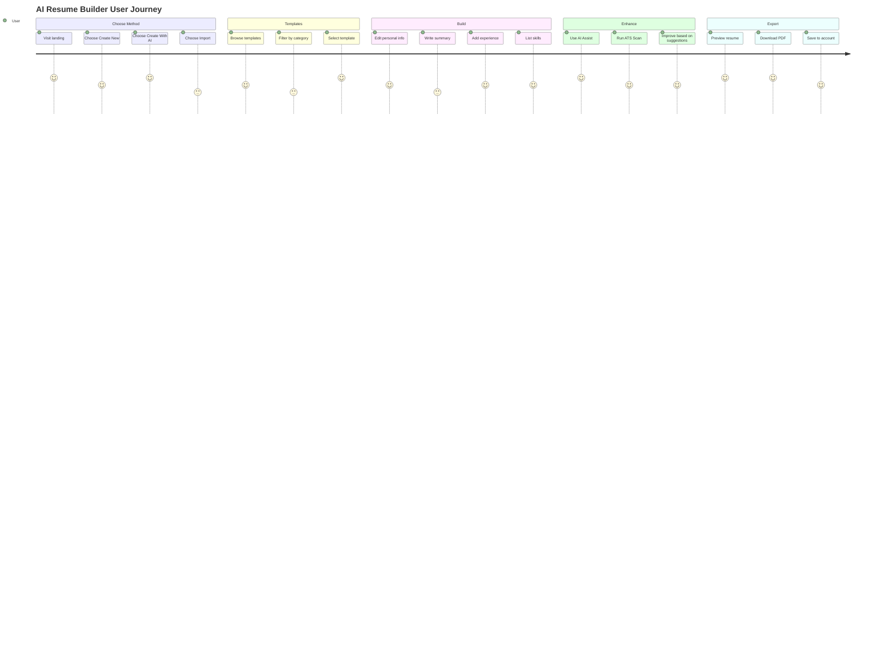

# 04_AI_Resume_Builder.md — AI Resume Builder

## Project Overview

- **Project Name:** NearbyHiring — AI-Powered Job & Career Platform
- **Module Name:** AI Resume Builder
- **Current Completion Status:** 92% Complete (Phase 2)
- **Technology Stack:** React 18, TypeScript 5, JavaScript (JSX), Vite 5, Tailwind CSS v4, Zustand, TanStack Query, Zod, Framer Motion, Lucide Icons, html2canvas, jsPDF
- **Primary Entry File:** `src/pages/AiResumeBuilder.tsx` → `src/resumeBuilder/ResumeBuilderApp.jsx`
- **Primary Route:** `/ai-resume-builder`
- **Sub-routes:** `/onboarding`, `/templates`, `/builder`, `/auth`, `/my-cvs`, `/cover-letter`, `/admin`
- **Backend:** PHP (`backend/api/resume-ai.php`, `backend/api/resume-resumes.php`, `backend/api/predict_content.php`, `backend/api/ai_enhance.php`, `backend/api/parse_pdf.php`)
- **Database:** MySQL (phase2_schema.sql: nh_resume_sessions, nh_resume_data, nh_ai_usage_log, nh_prediction_cache)
- **State:** Zustand with localStorage persistence (`nearby-resume-builder-store`)
- **AI Integration:** OpenRouter API, Google Gemini API, local AI prediction engine (zero-API)
- **PDF Export:** window.print() (primary) + html2canvas+jspdf (fallback)
- **Server:** Node.js PDF parser on port 3001 (`server/pdf-parser.js`)

---

## Purpose

The AI Resume Builder helps Indian job seekers create professional, ATS-optimized resumes with AI-powered content suggestions, multiple templates, and intelligent skill/experience recommendations — all without requiring external AI API calls for basic features.

### Business Goal

Improve employability of Indian youth (especially ITI/vocational students) by providing free, intelligent resume creation tools that produce ATS-compliant resumes with professional formatting and AI-enhanced content.

### Problem Solved

Indian job seekers struggle with:
- Creating professional resumes from scratch
- Writing impactful bullet points and summaries
- Optimizing resumes for ATS (Applicant Tracking Systems)
- Choosing the right template format
- Formatting and PDF export issues
- Knowledge of industry-standard keywords

### Target Users

- ITI/diploma students entering the job market
- College freshers (BE/BTech/BSc/BCA/BCom)
- Mid-career professionals updating resumes
- Career switchers repositioning their profile
- Government job applicants (standard format resumes)

---

## Features

| Feature | Description | Status |
|---------|-------------|--------|
| Resume Editor | Full WYSIWYG resume builder with live preview | Complete |
| Template Gallery | 12+ resume templates with ATS scores | Complete |
| Theme System | 12 themes with accent colors, fonts, sidebar options | Complete |
| AI Content Prediction | Local prediction engine (zero API cost) | Complete |
| AI Enhancement | API-based section improvement (1 use/session) | Complete |
| ATS Scanner | Local ATS score calculation (0-100) | Complete |
| PDF Export | Dual-mode export: print (vector) + html2canvas (raster) | Complete |
| PDF Import | Browser-side PDF/DOCX parsing with OCR fallback | Complete |
| Onboarding Wizard | Multi-step onboarding (guided/AI/import modes) | Complete |
| Saved Resumes | CRUD for saved resume drafts | Complete |
| Cover Letter | AI cover letter generation within builder | Complete |
| AI Dashboard | Usage analytics and AI feature dashboard | Complete |
| Multi-persona Data | 12 full persona datasets for template preview | Complete |
| Content Suggestions | Static suggestion engine for skills/summaries/bullets | Complete |

---

## Complete User Flow

```
User visits /ai-resume-builder
  → Landing page with 3 CTA cards:
    1. "Create New Resume" → /templates
    2. "Create With AI" → /onboarding (AI mode)
    3. "Import Existing Resume PDF" → /onboarding (import mode)

  CTA 1: Create New Resume
    → /templates → template gallery (30+ showcase items)
    → Select template → /builder?theme={id}
    → Builder loads with persona data

  CTA 2: Create With AI
    → /onboarding (AI mode) → Q&A form → AI generates content
    → /templates → select template
    → /builder with AI-generated content

  CTA 3: Import Existing Resume
    → /onboarding (import mode) → Upload PDF/DOCX/TXT
    → Browser-side parsing (pdf.js/mammoth/Tesseract OCR)
    → Extracted preview → /builder with parsed data

  Builder Flow:
    - Left: Editor form (sections: personal, summary, experience, education, skills, certifications)
    - Right: Live preview (scaled with ResizeObserver)
    - Top: Theme picker, AI Assist, ATS Analyzer, Export, Save
    - Bottom: Mobile editor sheet
```

## Screen Flow

```
AiResumeBuilder.tsx (5 lines)
  └── ResumeBuilderApp.jsx
      ├── LandingPage (/) — 3 CTA cards
      ├── Onboarding (/onboarding) — 3 modes
      ├── Templates (/templates) — Gallery with filters
      ├── Builder (/builder) — Editor + Preview + Tools
      ├── Auth (/auth) — Login/Register
      ├── CoverLetter (/cover-letter) — AI cover letter
      ├── Admin (/admin) — Admin panel
      └── MyCVs (/my-cvs) → redirects to AI dashboard
```

## Navigation Flow

```
/ → /ai-resume-builder → CTA → /onboarding | /templates
/ → /ai-resume-builder/templates → select → /builder?theme=X
/ → /ai-resume-builder/onboarding → complete → /templates → select → /builder
/ → /ai-resume-builder/builder → save → /my-cvs → /ai-dashboard
```

## UI Flow

```
Landing Page:
  3 CTA cards with hover animations, shine effect
  → Create New: loads templates immediately
  → Create With AI: redirects to onboarding Q&A
  → Import: redirects to file upload wizard

Templates Page:
  Category tabs (13: Trending, ATS Friendly, Freshers, IT, etc.)
  Filter groups: Resume Type (5), Style (7), Photo (3), Graphics (3), Columns (3), Color (9), Rating (3), Gender (3)
  TemplateCard: scaled preview, ATS score badge, gender-specific persona name
  ScaledResumeCard: ResizeObserver-based dynamic scaling

Builder Page:
  - Editor panel with sections (collapsible accordions)
  - Preview panel (live, auto-scaled to fit)
  - Theme picker (horizontal scroll, 12 themes)
  - Color palette (9 accent colors)
  - Font selector
  - AI Assist panel (1 free enhancement per session)
  - ATS Analyzer panel (score + recommendations)
  - Export button (download PDF)
  - Save button (localStorage + DB)
```

## Backend Flow

### AI Text Generation
```
POST /api/resume-ai.php
  Headers: — 
  Body: { prompt, expect_json: bool, timeout_ms: 5-60, temperature: 0-1, max_tokens: 256-4000, session_id }
  → Rate limited: 24 req/300s per IP+UA
  → Calls resume_ai_invoke() → OpenRouter API → returns { text, model, provider }
  → If expect_json: returns { result: parsedJSON }
  → Logs to nh_ai_usage_log
```

### Content Prediction
```
POST /api/predict_content.php
  Body: profile data (skills, experience, education, etc.)
  → Local PHP logic: matches skills, generates about_me, bullets
  → Returns predicted content for resume sections
```

### PDF Parsing
```
POST /api/parse_pdf.php
  File: uploaded PDF
  → smalot/pdfparser PHP library
  → Extracts: name, email, phone, skills, experience, education

OR (browser-side):

parsePdfBrowser(file):
  → PDF: pdf.js CDN (v4.4.168), extracts text from first 4 pages
  → DOCX: mammoth CDN, extracts raw text
  → TXT: file.text()
  → Image PDF: Tesseract.js OCR fallback
  Regex extractors: email, phone, name, summary, skills, experience, education, languages
```

## Frontend Flow

### AI Prediction Engine (`ai-prediction-engine.ts` — 589 lines)
```
generatePrediction(profile):
  1. Load 5 datasets: master_data.json, resume_bullets.json, about_me_templates.json, ats_keywords.json, fortune500_values_framework.json
  2. Infer career level from experience years (Entry → Leadership)
  3. Resolve industry via fuzzy scoring
  4. Extract skill signals from profile (skills, title, text, industry, ATS)
  5. Pick top 12 predicted skills (unique, weighted)
  6. Pick Fortune 500 professional values
  7. Collect bullet options (fuzzy score ≥ 0.35)
  8. Synthesize missing bullets (action verbs + impact snippets)
  9. Pick about_me template → fill variables
  10. Scan ATS keywords → return matched/missing

enhanceResumeSectionLocally(section, content, context):
  → "skills": returns predicted skills
  → "experience"/"bullets": rebuilds with action verbs
  → "ats": merges about_me with missing keywords
  → "coverLetter": generates 4-paragraph cover letter
```

### ATS Scanner (`ats-scanner.ts` — 170 lines)
```
scanResumeATS(resume):
  1. Flatten resume text from all sections
  2. Call generatePrediction() for keyword matches
  3. Score (0-100):
     - Completeness (0-14): personal info
     - Experience (0-16): roles with descriptions
     - Skills (0-10): count out of 8
     - Action verbs (0-20): bullets starting with verbs
     - Keywords (0-25): ATS keyword matches
     - Structure (0-15): summary, metrics, education, dates
  4. Return: { score, industry, missingKeywords, matchedKeywords, atsKeywords, issues, suggestions, strengths, breakdown }
```

### Content Suggestion Engine (`contentSuggestionEngine.ts` — 168 lines)
```
getSuggestedSkills(title, count, industry?, level?):
  → master_data.json#industry.skills[level] || content_suggestions.json#skills[category]
getSuggestedSummaries(title, count):
  → category-specific + global pool (100+ templates), shuffled
getSuggestedBullets(title, years):
  → entry/mid/senior bullets based on years, placeholder substitution
getSuggestedCertifications(title), getEducationTips(), getCommonLanguages(), getUniversalTraits()
```

### PDF Export (`pdfExport.js` — 138 lines)
```
Primary (Vector/ATS-safe):
  1. Open new window
  2. Clone stylesheets + inline styles
  3. Set @page { margin: 0; size: A4 }
  4. window.print()
  5. Auto-close after print

Fallback (Raster):
  1. html2canvas (scale 2x)
  2. jsPDF A4 portrait
  3. Save as JPEG
```

## Database Flow

### Tables (from `phase2_schema.sql`)

```sql
nh_resume_sessions:
  id INT PK AUTO_INCREMENT
  session_token VARCHAR(255) UNIQUE
  candidate_id INT
  industry VARCHAR(255)
  career_level VARCHAR(100)
  job_title VARCHAR(255)
  template_id VARCHAR(100)
  status ENUM('active','completed','abandoned')
  ai_enhance_used TINYINT(1) DEFAULT 0
  pdf_parsed TINYINT(1) DEFAULT 0
  created_at TIMESTAMP
  updated_at TIMESTAMP

nh_resume_data:
  id INT PK AUTO_INCREMENT
  session_id INT (FK → nh_resume_sessions.id)
  full_name VARCHAR(255)
  email VARCHAR(255)
  phone VARCHAR(50)
  city VARCHAR(255)
  linkedin VARCHAR(255)
  about_me TEXT
  skills_json JSON
  experience_json JSON
  education_json JSON
  certifications TEXT
  ats_score INT
  created_at TIMESTAMP

nh_ai_usage_log:
  id INT PK AUTO_INCREMENT
  session_id INT
  feature ENUM('about_me','bullets','skills','ats','cover_letter','full')
  model VARCHAR(100)
  provider VARCHAR(50)
  tokens_used INT
  cost_inr DECIMAL(10,4)
  created_at TIMESTAMP

nh_prediction_cache:
  id INT PK AUTO_INCREMENT
  cache_key VARCHAR(255) UNIQUE
  industry VARCHAR(255)
  career_level VARCHAR(100)
  prediction_json LONGTEXT
  hit_count INT DEFAULT 0
  expires_at TIMESTAMP
  created_at TIMESTAMP

-- Also from resume_livedomaingap_schema.sql:
resume_users, resume_sessions, resume_saved_resumes, resume_profiles, 
resume_projects, resume_downloads, resume_ai_usage, resume_ai_feedback, 
resume_notifications, resume_analytics_events
```

## JSON Structure

### Resume Data Model (from `resumeTypes.js`)
```typescript
defaultResume = {
  personal: {
    fullName, email, phone, city, linkedin, github, portfolio,
    photo: { url, size, aspectRatio }
  },
  summary: { content: string },
  experience: [{
    id, company, position, startDate, endDate, current,
    description, bullets: string[], location
  }],
  education: [{
    id, institution, degree, field, startDate, endDate, gpa
  }],
  skills: string[],
  certifications: [{ name, issuer, date }],
  languages: [{ language, proficiency }],
  projects: [{ name, description, url, technologies }],
  theme: string, // e.g., "classic", "ats", "harvard"
  accentColor: string,
  fontFamily: string,
  fontSize: string,
  sidebar: boolean,
  sectionOrder: string[],
  layout: { columns, margins }
}
```

### ATS Scan Result
```json
{
  "score": 78,
  "industry": "IT & Software Services",
  "missingKeywords": ["docker", "kubernetes", "ci/cd"],
  "matchedKeywords": ["javascript", "react", "node.js", "sql"],
  "atsKeywords": ["javascript", "react", "node.js", "sql", "docker", "kubernetes"],
  "issues": ["Missing skills section", "No metrics in experience"],
  "suggestions": ["Add Docker to skills", "Quantify achievements"],
  "strengths": ["Strong action verbs", "Complete education"],
  "breakdown": {
    "completeness": 12,
    "experience": 14,
    "skills": 6,
    "actionVerbs": 16,
    "keywords": 18,
    "structure": 12
  }
}
```

### AI API Request/Response
```json
// Request to /api/resume-ai.php
{
  "prompt": "Generate a professional summary for a software engineer with 5 years experience in React and Node.js...",
  "expect_json": false,
  "timeout_ms": 30000,
  "temperature": 0.7,
  "max_tokens": 500,
  "session_id": "abc123"
}

// Response
{
  "text": "Results-oriented software engineer with 5+ years...",
  "model": "openrouter/free",
  "provider": "openrouter"
}
```

## Folder Structure

```
src/
├── pages/
│   ├── AiResumeBuilder.tsx              ← Entry wrapper (5 lines)
│   ├── AiDashboard.tsx                  ← AI dashboard (lazy)
│   └── AiCoverLetter.tsx                ← Cover letter page
├── resumeBuilder/                       ← Full sub-application
│   ├── ResumeBuilderApp.jsx             ← Main app with routing (217 lines)
│   ├── main.jsx                         ← Alternative entry
│   ├── index.css                        ← Builder-specific styles
│   ├── App.css                          ← Legacy styles
│   ├── pages/
│   │   ├── LandingSection.jsx           ← Landing CTA section
│   │   ├── HomePage.jsx                 ← Home page
│   │   ├── Onboarding.jsx               ← Onboarding wizard (713 lines)
│   │   ├── Templates.jsx                ← Template gallery (1558 lines)
│   │   ├── Builder.jsx                  ← Resume editor (720 lines)
│   │   ├── CoverLetter.jsx              ← Cover letter generator (248 lines)
│   │   ├── Auth.jsx                     ← Login/register
│   │   ├── AiDashboard.jsx             ← AI analytics dashboard
│   │   ├── Admin.jsx                    ← Admin panel
│   │   ├── MyCVs.jsx                    ← Saved CVs
│   │   └── PageNotFound.jsx            ← 404
│   ├── components/
│   │   ├── resume/                      ← Resume-specific UI
│   │   │   ├── editor/                  ← Editor panels
│   │   │   └── preview/                 ← Theme previews (12 components)
│   │   ├── ui/                          ← 51 shadcn/ui components
│   │   ├── LandingSection.jsx
│   │   ├── LogoStrip.jsx
│   │   ├── ExpertInsightsBanner.jsx
│   │   ├── WhyUseSection.jsx
│   │   ├── ProtectedRoute.jsx
│   │   └── UserNotRegisteredError.jsx
│   ├── lib/                             ← 22 library files
│   │   ├── ai-prediction-engine.ts      ← Local AI engine (589 lines)
│   │   ├── ats-scanner.ts              ← ATS scanner (170 lines)
│   │   ├── pdfExport.js                ← PDF export (138 lines)
│   │   ├── contentSuggestionEngine.ts  ← Content suggestions (168 lines)
│   │   ├── aiClient.js                 ← AI API client (268 lines)
│   │   ├── aiHelpers.js                ← AI helper utilities
│   │   ├── localClient.js              ← API + localStorage client (426 lines)
│   │   ├── AuthContext.jsx             ← Auth context (173 lines)
│   │   ├── routes.js                   ← Route definitions (24 lines)
│   │   ├── runtimePaths.ts             ← Runtime path resolution (42 lines)
│   │   ├── aiDashboardContext.js       ← AI dashboard context (128 lines)
│   │   ├── themeRegistry.js            ← Theme registry (167 lines)
│   │   ├── normalizeThemeId.js         ← Theme ID normalization (56 lines)
│   │   ├── templateMarketplace.js      ← Template data (663 lines)
│   │   ├── resumeTypes.js              ← Resume data model (111 lines)
│   │   ├── defaultData.js              ← 12 persona datasets
│   │   ├── fontStacks.js               ← Font configuration
│   │   ├── resumeAssets.js             ← Asset URLs
│   │   ├── landingData.js              ← Landing page content
│   │   ├── app-params.js               ← App params
│   │   ├── query-client.js             ← React Query config
│   │   └── utils.js                    ← Utilities
│   ├── store/
│   │   └── useResumeStore.ts           ← Zustand store
│   ├── services/
│   │   └── aiProviderManager.ts        ← AI provider (87 lines)
│   ├── hooks/
│   │   ├── usePredictionEngine.js      ← Prediction hook (470 lines)
│   │   └── use-mobile.jsx              ← Mobile detection
│   └── api/
│       └── localClient.js              ← API client (same as lib)
├── hooks/
│   ├── use-toast.ts                    ← Toast notifications
│   └── use-mobile.tsx                  ← Mobile detection
backend/
├── api/
│   ├── resume-ai.php                   ← AI text generation (91 lines)
│   ├── resume-ai-usage.php             ← AI usage tracking
│   ├── resume-dashboard.php            ← Dashboard data
│   ├── resume-download.php             ← Resume download
│   ├── resume-onboarding.php           ← Onboarding data
│   ├── resume-resumes.php              ← Resume CRUD
│   ├── predict_content.php             ← Content prediction
│   ├── ai_enhance.php                  ← AI enhancement
│   ├── parse_pdf.php                   ← PDF parsing
│   └── resume/                         ← Auth/AI helpers
├── admin/
│   └── ai dashboard/                   ← Admin AI management
├── student/
│   ├── ai-resume.php                   ← Student AI resume
│   ├── ai-cover-letter.php             ← Student cover letter
│   ├── ai-mock-interview.php           ← Student interview
│   └── student-ai.php                  ← Student AI features
├── includes/resume/                    ← Resume includes
└── resume/                             ← Legacy resume endpoints
database/
├── phase2_schema.sql                   ← Resume builder schema
└── resume_livedomaingap_schema.sql     ← Live domain schema
server/
└── pdf-parser.js                       ← Node.js PDF parser (156 lines)
data/
├── about_me_templates.json             ← Summary templates
├── ats_keywords.json                   ← ATS keyword data
├── resume_bullets.json                 ← Bullet point templates
└── master_data.json                    ← Master career data
```

## Important Files

| File | Path | Role |
|------|------|------|
| ResumeBuilderApp.jsx | `src/resumeBuilder/ResumeBuilderApp.jsx` | Sub-app entry with routing |
| Builder.jsx | `src/resumeBuilder/pages/Builder.jsx` | Core resume editor (720 lines) |
| Templates.jsx | `src/resumeBuilder/pages/Templates.jsx` | Template gallery (1558 lines) |
| Onboarding.jsx | `src/resumeBuilder/pages/Onboarding.jsx` | Onboarding wizard (713 lines) |
| ai-prediction-engine.ts | `src/resumeBuilder/lib/ai-prediction-engine.ts` | Local AI engine (589 lines) |
| ats-scanner.ts | `src/resumeBuilder/lib/ats-scanner.ts` | ATS scanner (170 lines) |
| pdfExport.js | `src/resumeBuilder/lib/pdfExport.js` | PDF export (138 lines) |
| contentSuggestionEngine.ts | `src/resumeBuilder/lib/contentSuggestionEngine.ts` | Content suggestions (168 lines) |
| useResumeStore.ts | `src/resumeBuilder/store/useResumeStore.ts` | Zustand state |
| usePredictionEngine.js | `src/resumeBuilder/hooks/usePredictionEngine.js` | Prediction + PDF parsing (470 lines) |
| aiProviderManager.ts | `src/resumeBuilder/services/aiProviderManager.ts` | AI provider orchestration |
| localClient.js | `src/resumeBuilder/api/localClient.js` | Unified API client (426 lines) |
| AuthContext.jsx | `src/resumeBuilder/lib/AuthContext.jsx` | Auth management |
| themeRegistry.js | `src/resumeBuilder/lib/themeRegistry.js` | 12 theme definitions |
| templateMarketplace.js | `src/resumeBuilder/lib/templateMarketplace.js` | 30+ template showcase data |
| resume-ai.php | `backend/api/resume-ai.php` | AI generation endpoint |
| pdf-parser.js | `server/pdf-parser.js` | Node.js PDF parsing server |
| phase2_schema.sql | `database/phase2_schema.sql` | Database schema |
| resume_livedomaingap_schema.sql | `database/resume_livedomaingap_schema.sql` | Live domain schema |

## Important APIs

| Endpoint | Method | Input | Output |
|----------|--------|-------|--------|
| `/api/resume-ai.php` | POST | `{prompt, expect_json, timeout_ms, temperature, max_tokens, session_id}` | `{text, model, provider}` |
| `/api/resume-resumes.php` | GET/POST/PUT/DELETE | Resume data | Resume CRUD |
| `/api/predict_content.php` | POST | Profile data | Predicted content |
| `/api/ai_enhance.php` | POST | `{section, currentContent, contextData}` | Enhanced content |
| `/api/parse_pdf.php` | POST | PDF file | Extracted text |
| `/api/resume-dashboard.php` | GET | — | Dashboard data |
| `/api/resume-ai-usage.php` | GET | — | Usage stats |

## Important Components

| Component | Path | Purpose |
|-----------|------|---------|
| Builder.jsx | `src/resumeBuilder/pages/Builder.jsx` | Core editor with preview, theme picker, AI panels |
| Templates.jsx | `src/resumeBuilder/pages/Templates.jsx` | Template gallery with 13 category filters |
| Onboarding.jsx | `src/resumeBuilder/pages/Onboarding.jsx` | Multi-step onboarding (3 modes) |
| LandingSection.jsx | `src/resumeBuilder/components/LandingSection.jsx` | CTA cards for resume creation |
| ProtectedRoute.jsx | `src/resumeBuilder/components/ProtectedRoute.jsx` | Auth guard |
| Preview themes | `src/resumeBuilder/components/resume/preview/` | 12 theme preview components |

## Important Utilities

| Utility | File | Purpose |
|---------|------|---------|
| `generatePrediction()` | `lib/ai-prediction-engine.ts` | Full local AI prediction |
| `enhanceResumeSectionLocally()` | `lib/ai-prediction-engine.ts` | Section-specific enhancement |
| `buildOfflineResumeDraft()` | `lib/ai-prediction-engine.ts` | Build resume from scratch |
| `scanResumeATS()` | `lib/ats-scanner.ts` | ATS scoring |
| `exportPDF()` | `lib/pdfExport.js` | Dual-mode PDF export |
| `extractTextFromPdf()` | `hooks/usePredictionEngine.js` | Browser PDF parsing |
| `parsePdfBrowser()` | `hooks/usePredictionEngine.js` | PDF/DOCX/TXT parser |
| `getSuggestedSkills()` | `lib/contentSuggestionEngine.ts` | Skill suggestions |
| `getSuggestedSummaries()` | `lib/contentSuggestionEngine.ts` | Summary suggestions |
| `normalizeThemeId()` | `lib/normalizeThemeId.ts` | Theme ID alias resolution |

## Application Logic

### AI Prediction Engine (Full Local)
- **5 data sources**: master_data.json, resume_bullets.json, about_me_templates.json, ats_keywords.json, fortune500_values_framework.json
- **Career level inference**: Entry (<3yr) → Supervisory (3-5) → Middle (6-9) → Executive (10-13) → Higher (14-17) → Leadership (18+)
- **Industry resolution**: Fuzzy string scoring against master data keys
- **Skill extraction**: From profile skills, job title, user text, industry defaults, ATS keywords → top 12 unique weighted
- **Bullet synthesis**: Action verbs (Architected, Delivered, Optimized) + impact snippets (reducing turnaround by 28%)
- **Cover letter**: 4-paragraph structure (opening, role alignment, skills, closing)

### ATS Scoring Breakdown (100 points)
- Completeness: 14 pts (personal info)
- Experience: 16 pts (roles with descriptions)
- Skills: 10 pts (8+ skill count)
- Action Verbs: 20 pts (bullets starting with action verbs)
- Keywords: 25 pts (ATS keyword matching)
- Structure: 15 pts (summary length, metrics, education, dates)

### PDF Export Decision Tree
```
if window.print() available:
  → Open new window → clone CSS → @page A4 → print → close
else if popup blocked:
  → html2canvas(scale=2) → jsPDF A4 → save as JPEG
```

## Rendering Logic

- **Builder Preview**: ResizeObserver dynamically scales 794px-wide preview to fit container width
- **Template Grid**: Responsive grid (4-col desktop → 2-col tablet → 1-col mobile)
- **ScaledResumeCard**: Uses ResizeObserver to match preview container height
- **Theme Preview**: Each theme has a React component rendering a full resume with persona data
- **Editor Form**: Accordion sections with collapsible panels for each resume section

## Search Logic

- Template gallery: text search on template name/description
- Category tabs: 13 pre-defined groups (Trending, ATS Friendly, Freshers, etc.)

## Filtering Logic

Templates page has 8 filter groups:
- Resume Type: 5 options (Modern, Classic, etc.)
- Style: 7 options
- Photo: 3 options (With Photo, Without, Optional)
- Graphics: 3 options
- Columns: 3 options
- Accent Color: 9 options
- Rating: 3 options (★★★★+)
- Gender: 3 options

## State Management

### Zustand Store (`useResumeStore.ts`)
```typescript
state: {
  resume: ResumeData          // Full resume object
  aiEnhanceUsed: boolean     // 1 free AI enhance per session
  aiLoading: boolean
  atsReport: ATSResult | null
  predictionData: PredictionResult | null
}
actions: {
  mergeResume(partial)       // Merge partial resume data
  resetResume()              // Reset to defaults
  setResume(data)            // Full replace
  setAiEnhanceUsed(bool)
  setAtsReport(report)
  setPredictionData(data)
  setAiLoading(bool)
}
persist: localStorage("nearby-resume-builder-store")
```

### Builder.jsx (11+ state variables)
```typescript
resume: ResumeData
saving, exporting: boolean
activeTab: string
scale: number (0.55 default)
showPalette, showSettings, showMobilePreview, showMobileEditor: boolean
showWizard, showAnalyzer, showTemplates, showPremiumModal: boolean
defaultTheme: string
previewRef, mobilePreviewRef: RefObject
mobileScale: number
```

## Local Storage

| Key | Content | Purpose |
|-----|---------|---------|
| `nearby-resume-builder-store` | Full Zustand state | Resume data persistence |
| `local_resumes` | ResumeData[] | Local CRUD fallback |
| `AI_SOURCE_KEY` | string | Source tracking for dashboard |
| `AI_RETURN_KEY` | string | Return URL after auth |
| `AI_DASHBOARD_URL_KEY` | string | Dashboard redirect URL |

## Session Usage

- PHP session for resume auth (token-based)
- Guest token for unauthenticated resume creation
- `aiEnhanceUsed` tracked in localStorage (frontend) + DB (backend)
- Onboarding completion tracked in session

## Future Scalability

- Can add more templates (currently 12 themes, 30 showcase items)
- AI prediction engine can be replaced with actual ML model
- PDF export can support additional formats (DOCX, RTF)
- Templates can support dynamic branding for organizations
- Resume analytics can track application success rates

## Performance Notes

- AI prediction engine is purely local — no network latency
- Browser PDF parsing uses CDN-loaded libraries (pdf.js, mammoth, Tesseract)
- Templates page uses lazy-loaded theme preview components
- Builder preview uses ResizeObserver for efficient re-scaling
- Zustand store partializes state for efficient re-renders

## Dependencies

- `zustand` — State management with localStorage persistence
- `@tanstack/react-query` — Server data fetching
- `zod` — Form validation
- `html2canvas` + `jspdf` — PDF fallback export
- `framer-motion` — Landing animations
- `lucide-react` — Icons
- `react-router-dom` — Sub-app routing
- `clsx` + `tailwind-merge` — Utility class merging

## Known Limitations

1. AI prediction engine is rule-based, not ML-trained
2. PDF parsing may fail for complex/scanned documents without OCR
3. AI enhancement is limited to 1 use per session (anti-abuse)
4. Template previews use persona data, not user data
5. Cover letter generation is text-only (no formatting)
6. Node.js PDF parser runs on port 3001 — requires separate process

## Future Improvements

1. **ML-powered content generation** replacing rule-based engine
2. **Real-time collaboration** for team resume reviews
3. **LinkedIn profile import** as data source
4. **Company-specific resume optimization** (TCS, Infosys templates)
5. **Resume version history** with diff comparison
6. **Interview scheduling integration** from resume
7. **Mobile resume builder** with optimized touch UI
8. **Bulk resume generation** for placement cells

---

## Architecture Diagram (Mermaid)

```mermaid
flowchart TD
    subgraph Frontend Sub-Application
        APP[ResumeBuilderApp.jsx] --> LAND[LandingPage]
        APP --> ONB[Onboarding.jsx]
        APP --> TEM[Templates.jsx]
        APP --> BLD[Builder.jsx]
        APP --> CL[CoverLetter.jsx]
        APP --> AUTH[Auth.jsx]
        APP --> DASH[AiDashboard.jsx]
        APP --> ADM[Admin.jsx]
        BLD --> EDIT[Editor Panel]
        BLD --> PREV[Preview Panel]
        BLD --> THM[Theme Picker]
        BLD --> AI[AI Assist Panel]
        BLD --> ATS[ATS Analyzer]
    end
    subgraph State
        STORE[useResumeStore<br/>Zustand + localStorage]
    end
    subgraph AI Engine
        PRED[ai-prediction-engine.ts<br/>Local, zero-API]
        ATS2[ats-scanner.ts]
        SUG[contentSuggestionEngine.ts]
        PDF[pdfExport.js]
        PPDF[usePredictionEngine.js<br/>Browser PDF Parser]
    end
    subgraph Backend
        AIAPI[resume-ai.php] --> OPENROUTER[OpenRouter API]
        PREDICT[predict_content.php]
        ENHANCE[ai_enhance.php]
        PARSE[parse_pdf.php]
        RES[resume-resumes.php]
        NODE[pdf-parser.js :3001]
    end
    subgraph Database
        DB[(MySQL<br/>nh_resume_* tables)]
        LB[(localStorage)]
    end
    Frontend --> STORE
    Frontend --> AI Engine
    Frontend --> Backend
    Backend --> DB
    STORE --> LB
```

## Data Flow Diagram (Mermaid)

```sequenceDiagram
    participant U as User
    participant BLD as Builder
    participant STORE as Zustand Store
    participant PRED as AI Prediction Engine
    participant ATS as ATS Scanner
    participant API as Backend API
    participant AIAPI as OpenRouter

    U->>BLD: Edit resume section
    BLD->>STORE: mergeResume()
    STORE->>STORE: Persist to localStorage

    U->>BLD: Click AI Assist
    BLD->>PRED: generatePrediction(profile)
    PRED->>PRED: Load 5 datasets
    PRED->>PRED: Infer level, resolve industry, score skills
    PRED-->>BLD: predicted skills, bullets, summary

    U->>BLD: Click ATS Scan
    BLD->>ATS: scanResumeATS(resume)
    ATS->>PRED: get keyword matches
    PRED-->>ATS: matched/missing keywords
    ATS->>ATS: Score (0-100)
    ATS-->>BLD: {score, issues, suggestions}

    U->>BLD: Click AI Enhance
    BLD->>API: POST /api/ai_enhance.php
    API->>AIAPI: OpenRouter text generation
    AIAPI-->>API: generated text
    API-->>BLD: enhanced content
    BLD->>STORE: mergeResume()

    U->>BLD: Click Export PDF
    BLD->>PDF: exportPDF(previewRef)
    alt print available
        PDF->>PDF: Open print window + clone CSS
    else popup blocked
        PDF->>PDF: html2canvas → jsPDF
    end
    PDF-->>BLD: PDF downloaded

    U->>BLD: Click Save
    BLD->>API: POST /api/resume-resumes.php
    API->>STORE: save to DB
    STORE->>LB: save to localStorage
```

## User Journey (Mermaid)



---

## AI Model Context

### Architecture Overview
The AI Resume Builder is a **complete sub-application** within the NearbyHiring SPA. It has its own routing, state management (Zustand), API layer, component library (51 shadcn/ui components), and AI engine. The core AI features work entirely offline using a local prediction engine (589 lines) — no API keys needed.

### Dependencies
- **Critical:** `useResumeStore.ts`, `ai-prediction-engine.ts`, `ats-scanner.ts`, `pdfExport.js`
- **UI:** `Builder.jsx` (720 lines), `Templates.jsx` (1558 lines)
- **Data:** 5 JSON datasets in `data/`
- **Backend:** PHP API endpoints for AI + CRUD + PDF parsing
- **Services:** `aiProviderManager.ts` for OpenRouter integration

### Things That Must Never Be Changed
1. The Zustand store state shape (resume, aiEnhanceUsed, aiLoading, atsReport, predictionData)
2. The default resume data model in `resumeTypes.js`
3. The theme registry ID structure (used by templateMarketplace, normalizeThemeId)
4. The ATS scoring breakdown (6 categories, 100 points total)
5. The `aiEnhanceUsed` guard (1 use per session)

### Reusable Components
- `ScaledResumeCard` — Dynamic scaling preview component
- `TemplateCard` — Template showcase card with ATS badge
- `ResumeEditor` — Section-editable form panels
- `ThemePicker` — Horizontal scroll theme selector

### Critical Files
- `src/resumeBuilder/pages/Builder.jsx` — Core builder (720 lines)
- `src/resumeBuilder/pages/Templates.jsx` — Template marketplace (1558 lines)
- `src/resumeBuilder/lib/ai-prediction-engine.ts` — Local AI engine (589 lines)
- `src/resumeBuilder/lib/ats-scanner.ts` — ATS scanner (170 lines)
- `src/resumeBuilder/lib/pdfExport.js` — PDF export (138 lines)
- `src/resumeBuilder/store/useResumeStore.ts` — State management
- `src/resumeBuilder/hooks/usePredictionEngine.js` — PDF parsing hook (470 lines)
- `src/resumeBuilder/services/aiProviderManager.ts` — AI orchestration
- `backend/api/resume-ai.php` — Backend AI generation
- `server/pdf-parser.js` — Node.js PDF server

### Safe Modification Areas
- Adding new resume templates (follow themeRegistry.js pattern)
- Adding new AI prediction logic in ai-prediction-engine.ts
- Adding new sections to the resume editor
- Modifying template styles and preview components
- Adding new fields to the resume data model
- Extending the content suggestion engine

### Danger Areas
- Changing the Zustand persist key (breaks existing user data)
- Modifying the ATS scoring algorithm without validation
- Removing the `aiEnhanceUsed` guard without rate limit backend
- Changing the `@page` CSS for PDF export (breaks ATS compatibility)
- Modifying the theme alias mapping in normalizeThemeId.js

### Future Extension Points
1. Replace `ai-prediction-engine.ts` with actual ML model
2. Add DOCX export (currently PDF only)
3. Add multi-language resume support
4. Integrate with job matching for targeted resume optimization
5. Add real-time collaboration features
6. Add API for placement cell bulk resume generation

---

## PPT Generation Context

### Executive Summary
The AI Resume Builder is a complete sub-application for creating professional, ATS-optimized resumes. It features 12+ templates, a local AI prediction engine (zero API cost), ATS scoring, browser-based PDF parsing, and dual-mode PDF export — all within an intuitive editor with live preview.

### Problem
Indian job seekers, especially from non-elite backgrounds, lack access to professional resume creation tools. Existing solutions are either expensive, produce non-ATS formats, or require constant internet/AI API calls.

### Solution
A fully-featured resume builder with offline AI capabilities: local prediction engine generates skills, bullets, and summaries without API calls; ATS scanner provides instant feedback; 12+ professional templates with live preview.

### Architecture
- **Frontend:** React 18 + TypeScript + Zustand + Tailwind v4
- **AI Engine:** Local (rule-based) + Remote (OpenRouter/Gemini) dual mode
- **Export:** Dual-mode PDF (print vector + html2canvas raster)
- **Parsing:** Browser-side (pdf.js + mammoth + Tesseract OCR)
- **Backend:** PHP 8 + MySQL + Node.js (PDF parser)

### Workflow
1. Create/AI/Import → Template selection → Editor with live preview
2. AI Assist generates content, ATS Scanner scores resume
3. User edits sections, picks theme/color/font
4. Export as ATS-safe PDF or save for later

### Technology
React 18, TypeScript, Zustand, TanStack Query, Tailwind v4, Framer Motion, html2canvas, jsPDF, pdf.js, PHP 8, MySQL, Node.js

### Features (12 total)
Resume Editor, Template Gallery (12 themes + 30 showcase), Theme System, AI Content Prediction (local), AI Enhancement (API), ATS Scanner, PDF Export (dual-mode), PDF/DOCX Import, Onboarding Wizard, Saved Resumes, Cover Letter, AI Dashboard

### Advantages
- Zero API cost for basic AI features (local engine)
- Browser-side PDF parsing (works on shared hosting)
- Dual-mode PDF export (ATS-vector or raster)
- 12 professional templates with real-time preview
- Zustand + localStorage for offline resilience

### Future Scope
ML-powered content generation, LinkedIn import, company-specific templates, real-time collaboration, mobile app, bulk generation for placement cells
